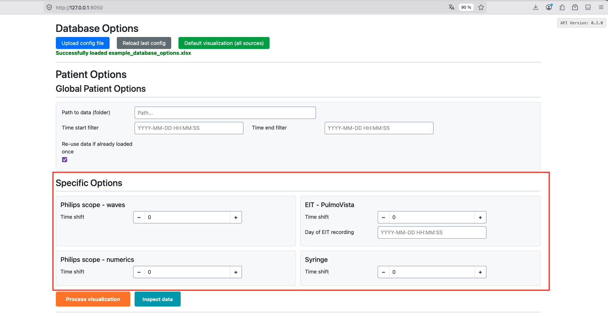
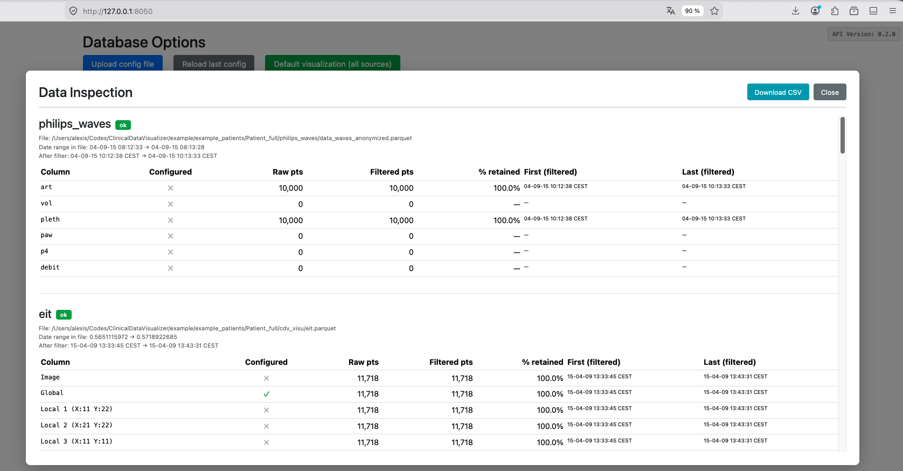
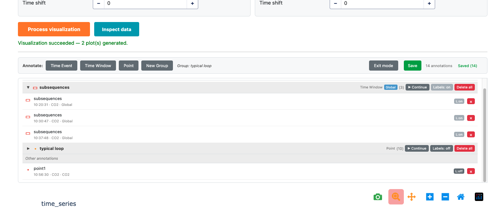
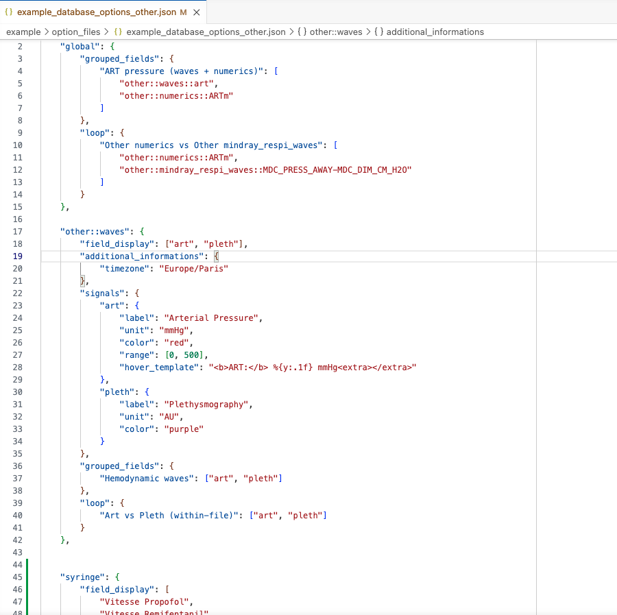
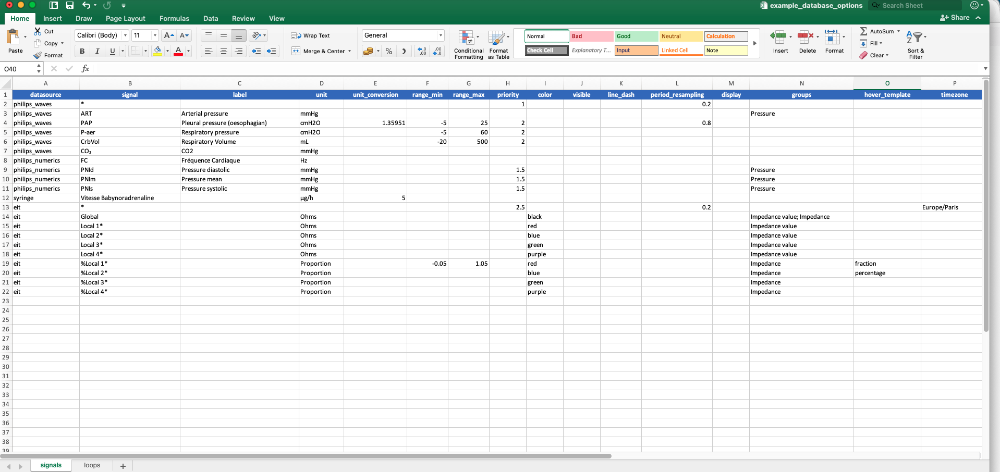
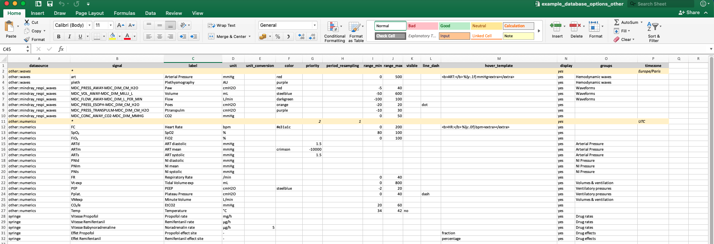
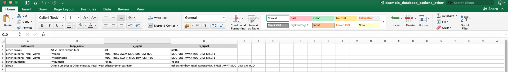

\newpage

# Introduction

Clinical Scope is an interactive dashboard for visualizing clinical physiological
signals. It allows clinicians and researchers to explore, compare, and annotate time-series data
from multiple medical devices in a single unified interface.

## Key Features

- **Multi-source visualization**: Display signals from multiple clinical data sources
  simultaneously (Philips, FluxMed, Mindray, EIT, Servo-U, syringe pumps, plus a
  generic "Other" source for any CSV/parquet).
- **Generic "Other" data source**: Drop any CSV or Parquet file with a datetime column
  into an `other/` folder — signals are auto-discovered and can be configured per file.
- **Interactive plots**: Zoom, pan, and explore data at any time scale with automatic resampling.
- **Data inspection**: Preview available columns, point counts, and time ranges for every source
  before running the full visualization — exportable to CSV.
- **Annotations**: Draw lines and rectangles directly on plots to mark events or regions of
  interest. Annotations are saved and persist across sessions.
- **Flexible configuration**: Choose which signals to display, customize labels, units, colors,
  and group related signals together — in JSON or Excel format.
- **Cross-datasource phase loops**: Define loop entries to build phase plots that
  combine signals from different devices.
- **Per-datasource timezone control**: Override the timezone of any supported source via
  `additional_informations.timezone` (all plots still render in the configured display timezone).
- **Export**: Generate standalone HTML visualizations for sharing.

The full list of supported data sources — with folder keywords, accepted file extensions, and
typical signals — lives in Section 3: **Patient Data & Supported Data Sources**.

\newpage

# Launching the Application

## Starting the App

Locate the **ClinicalScope** executable in the application folder and double-click it.

A terminal window will appear showing the application starting up. After a few seconds, your
default web browser will automatically open at:

```
http://127.0.0.1:8050
```

If the browser does not open automatically, manually navigate to the address above.

{ width=100% }

The app also comes with the userguide (this document) and template folder to help organizing patient data for the app. Once runned for the first time, a `logs` folder will also appear, helping to debug if needed.

## Application Overview

The interface is organized top-to-bottom in the following order:

1. **Database Options** -- Three buttons side-by-side:
    - **Upload config file** (blue) -- load a custom `database options` file, either [`.json`](#database_optionsjson) or [`.xlsx`](#database_optionsxlsx).
    - **Reload last config** (grey) -- appears only if a previously uploaded config was cached;
      restores it with one click.
    - **Default visualization (all sources)** (green) -- enables every registered data source with
      default settings, no file needed.
2. **Patient Options** -- Configure data folder, time range, and per-source settings.
   The form is generated dynamically from the loaded database options.
3. **Action buttons** -- **Process visualization** (orange) and **Inspect data** (teal).
4. **Annotations Controls** -- Shape dropdown + Modify/Delete buttons (visible after a
   successful visualization).
5. **Inspection pop-up** -- Full-screen overlay triggered by the Inspect button, with per-source
   status badges, column tables, and a CSV download.
6. **Visualization Area** -- Interactive plots.

{ width=100% }

\newpage

# Patient Data & Supported Data Sources

Each patient's data must be organized in a root folder with **one subfolder per data source**.
The application automatically identifies data sources based on keywords in subfolder names.

You only need subfolders for the data sources you actually have — empty or missing
subfolders are silently skipped. The `clinical_scope_output/` subfolder is created automatically the
first time you process a patient. It contains annotations, `.html` visualizations, formatted data.

## Example Folder Layouts

A full setup with several devices:

```
Patient1/
  philips_waves/
  philips_numerics/
  eit/
  fluxmed_signals/
  fluxmed_parameters/
  servo_u/
  syringe/
  clinical_scope_output/               ← auto-created,
```

A minimal setup:

```
Patient1/
  philips_waves/
  clinical_scope_output/
```

An **"Other"-heavy** setup — drop any CSV/Parquet file with a datetime column into
`other/`; each file is configured independently via `other::<stem>` keys in the
database options (see [dedicated section](#generic-other-data-source) below):

```
Patient1/
  other/
    waves.parquet         → configured under "other::waves"
    numerics.csv          → configured under "other::numerics"
    syringe_log.csv       → configured under "other::syringe_log"
  clinical_scope_output/
```

## Folder Naming Rules

Folder names are **flexible** — they just need to contain the required keywords:

- **Case-insensitive** — `Philips_Waves`, `PHILIPS-WAVES`, `philips waves` all match.
- **Any separator** — underscore, dash, space, or none.
- **Any order** — `waves_philips` works just as well as `philips_waves`.
- **Partial keywords don't match** — `flux` alone will not match `fluxmed_*`; the full word is required.

A few sources are also **identified by file extension** when the folder is ambiguous or
generic (e.g., `.asc` files inside a folder are enough to classify it as EIT, `.sta` for
Servo-U, `.xml` for Mindray Scope). See the canonical table below for exact keywords
and accepted extensions per source.

## Canonical Data Source Table

The table below is the single source of truth for supported data sources and is what all
folder-discovery / skill logic refers to.

| Source | Module name | Folder keywords | Accepted extensions (ordered by preference) | Discovery mode | Typical signals |
|---|---|---|---|---|---|
| Philips Waves | `philips_waves` | `philips`, `waves` | `.parquet`, `.csv` | Single file | ART, PAP, CO2, respiratory pressure/volume |
| Philips Numerics | `philips_numerics` | `philips`, `numerics` | `.parquet`, `.csv` | Single file | Heart rate, SpO2, FiO2, blood pressure |
| EIT (PulmoVista) | `eit` | `eit` | `.asc` | All files | Global/local impedance, impedance percentages |
| FluxMed Signals | `fluxmed_signals` | `fluxmed`, `signals` | `.parquet`, `.txt`, `.csv` | Single file | Respiratory waveforms |
| FluxMed Parameters | `fluxmed_parameters` | `fluxmed`, `parameters` | `.parquet`, `.txt`, `.csv` | Single file | Respiratory parameters |
| Servo-U | `servo_u` | `servo` | `.sta` | All files | Ventilator waveforms and settings |
| Mindray Scope | `mindray_scope` | `mindray` | `.xml`, `.csv` | All files | Monitor waveforms (ECG, SpO2, pressure) |
| Mindray Respi Waves | `mindray_respi_waves` | `mindray`, `resp`, `wave` | `.parquet`, `.csv` | Single file | High-frequency respiratory waveforms |
| Mindray Respi Numerics | `mindray_respi_numerics` | `mindray`, `resp`, `numeric` | `.parquet`, `.csv` | Single file | Respiratory parameters (Vt, RR, PEEP, etc.) |
| Syringe | `syringe` | `syringe` | `.parquet`, `.csv` | Single file | Infusion rates and volumes |
| Other (Generic) | `other` | `other` | `.csv`, `.parquet` | All files (one entry **per file**) | Any time-series with a datetime column |

**Single file** sources expect exactly one data file per folder. When several formats coexist
(e.g., `data.csv` and `data.parquet`), the most preferred extension wins. If multiple unrelated
stems remain after that filter, the source is skipped and a warning is logged.

**All files** sources load every matching file in the folder and concatenate them. The `Other`
source is special: each file produces an independent entry named `other::<stem>` (see below).

Per-source configuration options (`field_display`, `signals`, `grouped_fields`, `loop`,
`additional_informations`, etc.) are documented in the [Configuration File Reference section](#configuration-file-reference).

{ width=100% }

## Generic "Other" Data Source

`other` is the **generic escape hatch** for any CSV or Parquet file that has a datetime
column but does not fit any of the specialised sources. It is the most natural entry point
for users who already have well formatted data.

**How it works:**

- Drop any number of `.csv` or `.parquet` files into an `other/` subfolder.
- Every file is discovered automatically — no separate folder or config key per file.
- Each file produces an **independent entry** keyed by its stem (filename without extension):
  a file named `waves.parquet` becomes `other::waves`, `numerics.csv` becomes
  `other::numerics`, and so on.
- Columns within a file are exposed as `<stem>::<column_name>` so names stay globally
  unique (important for cross-datasource groups and loops).

**Datetime column auto-detection.** The loader tries the common names first
(`datetime`, `timestamp`, `time`, `date`, `date_time` — case-insensitive). If none match,
it falls back to scanning non-numeric columns for parseable timestamps.

**Per-file configuration.** In `database_options`, use `other::<stem>` keys — one block per
file — exactly like any other datasource:

```json
"other::waves": {
    "field_display": ["art", "pleth"],
    "signals": {
        "art":   { "label": "Arterial Pressure", "unit": "mmHg", "color": "red" },
        "pleth": { "label": "Plethysmography",  "unit": "AU",   "color": "purple" }
    },
    "additional_informations": { "timezone": "Europe/Paris" }
},
"other::numerics": {
    "field_display": ["FC", "SpO2"],
    "additional_informations": { "timezone": "UTC" }
}
```

**Per-file timezone.** Each `other::<stem>` block may declare its own
`additional_informations.timezone` — useful when the CSV you dropped in comes from a
device in a different timezone than your default.

**Inspection shows one entry per file.** When you click *Inspect data* for a patient with
an `other/` folder, the modal lists one row per file (`other::waves`, `other::numerics`, …),
each with its own date range and column list, so you can verify that every file was
correctly discovered and parsed.

See `example/option_files/example_database_options_other.json` in the source repository
for a full reference configuration.

\newpage

# Loading Database Options

Database options define **which data sources to enable** and **how signals should be displayed**
(labels, units, colors, grouping).

There are three ways to get a database options config into the app, presented here in the
order you are most likely to use them.

## Option 1: Upload a Custom Configuration File

Click the blue **"Upload config file"** button to load a custom configuration. Two formats are
accepted:

- **`.json` extension** — a JSON file following the structure described in
  [Configuration File Reference section](#configuration-file-reference).
- **`.xlsx` extension** — an Excel spreadsheet following the column layout documented in
  the same reference. The spreadsheet is converted to the equivalent JSON structure on load.

This gives you full control over which sources are enabled and how each signal is displayed.

When the upload succeeds the file is **cached locally** at
`~/.clinical_scope/last_database_options.json` — this is what powers Option 2 below.
Such a database option file should only contains signal metadata (labels, colors, units, field mappings) and no patient data or PHI, to ensure no sensitive information is cached and so leaves the original patient folder.

## Option 2: Reload Last Config (Daily Workflow)

If a custom configuration was previously uploaded, a grey **"Reload last config"** button appears
automatically on startup. Click it to instantly restore the last used configuration without
browsing for files — ideal when you re-open the app every day with the same setup.

This button is **hidden** when no cached configuration exists.

## Option 3: Default Visualization (Quick Start)

Click the green **"Default visualization (all sources)"** button. This automatically enables
**every registered data source** with its built-in default display settings — no configuration
file needed. This is the recommended starting point for new users, and it automatically picks up
any new data sources added to the library without requiring a config update. Note that if you have hundreds of timeseries, they will all be plot and you may experience performance issues on the app.

{ width=100% }

\newpage

# Configuring Patient Options

After loading database options, the **Patient Options** form appears. It is divided into two
parts: global options and per-source options.

## Global Options

These apply to all data sources:

| Option | Description |
|---|---|
| **Path to data (folder)** | Full path to the patient's root data folder |
| **Time start filter** | Start of the time window to display (format: `YYYY-MM-DD HH:MM:SS`). Leave empty to use all available data. |
| **Time end filter** | End of the time window to display. Leave empty to use all available data. |
| **Re-use data if already loaded once** | When checked, reuses previously cached `.parquet` files from the `clinical_scope_output/` folder, significantly speeding up subsequent loads. **Un-tick** if raw patient data has been modified |

{ width=100% }

## Per-Source Options

Below the global options, each enabled data source may have additional settings displayed in
individual cards arranged in a two-column grid. Common per-source options include:

- **Time shift** (seconds): Adjust the time alignment of a source relative to others. Useful
  when devices were not perfectly synchronized.
- **Day**: Specify the recording date for sources that require it (e.g., EIT data).

Only data sources present in the loaded database options will show their configuration cards.

{ width=100% }

\newpage

# Processing Data

Once patient options are configured, two actions are available from the action row. **Both
run the same data pipeline** — find → load → format — and share the same per-datasource
progress bar. What differs is only the outcome: the orange button builds interactive plots,
the teal button produces a structured summary of what was found.

> **Recommended workflow**: start with **Inspect data** (teal button). It completes faster
> because no plots are built, and it immediately surfaces loading errors, missing folders, or
> unexpected column names.

## Process Visualization (orange button)

Click the large orange **"Process visualization"** button to generate the plots. The steps are:

1. **Validation**: The application verifies that all mandatory fields are filled in and that the
   data folder exists.
2. **Data Discovery**: For each enabled data source, the application scans the patient folder for
   matching subfolders and files.
3. **Data Loading**: Raw data files are parsed according to each source's format.
4. **Formatting**: Signals are filtered, resampled, and converted using your database options
   (labels, units, time range).
5. **Caching**: Processed data is saved as `.parquet` files in the `clinical_scope_output/` subfolder for
   faster reloading next time. Tick **"Re-use data if already loaded once"** (`quick_load`) to
   skip raw parsing on subsequent runs and read the cache instead.
6. **Plot Generation**: Interactive Plotly figures are created and displayed in the visualization
   area.

While processing runs, a **per-datasource progress bar** appears below the action row. It shows
`(completed / total): <datasource>` and its color matches the action — orange for visualization.
The bar advances as each datasource completes; it never reaches 100% while the last source is
still being processed (by design, so you always see which source is active).

A success message appears when processing completes. If no data is found for a source, it is
silently skipped.

## Inspect Data (teal button)

The teal **"Inspect data"** button runs the same `find → load → format` pipeline but
**stops before signal extraction and plot building**. It is the **recommended first step**
when opening a new patient folder: no figures are built so it is significantly lighter,
and it immediately exposes any loading errors, missing folders, or unexpected column names
— letting you catch problems before running the heavier visualization.

The same progress bar is shown during inspection, colored teal.

When inspection completes, a **full-screen inspection modal** opens, with one section per
datasource containing:

- **Status badge** — colored per outcome:
    - green `ok` — data loaded successfully
    - orange `file_not_found` — no matching file/folder in the patient directory
    - red `load_error` or `format_error` — loading or formatting raised an exception (the
      error message is shown below the badge)
- **File path** — the detected data file or folder.
- **Date ranges** — both the raw (unfiltered) and filtered time ranges.
- **Columns table** — each column with: raw name, whether it is configured in the database
  options, raw point count, filtered point count, and first/last filtered timestamps.

> **Note for the Other (Generic) source**: because the `other` folder may contain several
> independent files, the inspection modal shows **one entry per file** (e.g. `other::waves`,
> `other::numerics`) rather than a single aggregated entry. Each entry has its own date range
> and column list.

A **"Download CSV"** button in the modal header exports the full inspection result as a CSV
for offline analysis, sharing, or import into the `generate-database-options` helper.

{ width=100% }

## Inspecting from the Command Line

The same inspection is available as a standalone script:

```bash
python scripts/inspect_patient_data.py <patient_folder> \
    [--database-options <path>] \
    [--patient-options <path>] \
    [--output-csv out.csv] \
    [--verbose]
```

Without `--database-options`, all registered datasources are inspected with their defaults.
Pass `--output-csv` to save the same per-column table the UI download produces.

\newpage

# Interacting with Plots

## Navigation Controls

Each plot provides a toolbar (top-right corner) with the following tools:

| Tool | Action |
|---|---|
| **Zoom** | Click and drag to zoom into a rectangular region |
| **Pan** | Click and drag to move the view |
| **Zoom In / Zoom Out** | Incremental zoom buttons |
| **Autoscale** | Reset the view to fit all data |
| **Reset Axes** | Return to the original view |
| **Download as PNG** | Save the current plot view as an image |

## Zooming and Panning

- **Scroll wheel**: Zoom in/out on the x-axis.
- **Click and drag**: Select a region to zoom into.
- **Double-click**: Reset the axes to show all data.

## Dynamic Resampling (FigureResampler)

For high-frequency signals (e.g., waveforms sampled at hundreds of Hz), the application uses
**Plotly-Resampler** to dynamically load detail as you zoom in. When viewing a long time range,
the plot shows a downsampled overview. As you zoom into a shorter time window, the full-resolution
data is loaded automatically.

This keeps the interface responsive even with millions of data points.

{ width=100% }

\newpage

# Annotations

The annotation system lets you mark events, time windows, or individual points directly on the
plots. Annotations are saved to `annotations.json` in the patient folder and persist across
sessions.

## Annotation Toolbar

After a successful visualization, the **annotation toolbar** appears above the plots. It contains:

- **Type buttons** — select the annotation type to place next: *Time Event*, *Time Window*, or *Point*.
- **New Group** — create a named group to organise related annotations.
- **Active group display** — shows which group new annotations will belong to.
- **Save** — writes all annotations to disk.
- **Exit mode** — visible while a type is active; click to stop placing annotations without saving.

## Annotation Types

| Type | Description | Supported plots |
|---|---|---|
| **Time Event** | Vertical line marking a single instant | Time-axis plots only |
| **Time Window** | Shaded region spanning a time range | Time-axis plots only |
| **Point** | Dot marker at a specific (x, y) location | All plots including loop plots |

Click a type button to activate it, then click (or click-and-drag for Time Window) on a plot.
A creation modal appears where you can set a **label** and **color** before confirming.

## Groups

Annotations can be organised into named groups. Click **New Group**, enter a name, and all
subsequent annotations will belong to that group until you switch or create another. Groups are
a runtime concept — they are not persisted in `annotations.json`; instead each annotation stores
its `group_id` and `group_name` inline.

## Persistence

Click **Save** to write annotations to `annotations.json` in the patient data folder (next to the
datasource sub-folders). Annotations are reloaded automatically when you re-process the same
patient.

## Python API

Annotations can be loaded programmatically for analysis:

```python
from clinical_scope import load_annotations, load_database_annotations

# Single patient — accepts a JSON file, a clinical_scope_output/ folder, or a patient folder
annotations = load_annotations("/data/Patient01")

# Whole database — scans all patient sub-folders and sets ann.patient on each result
all_anns = load_database_annotations("/data")
```

{ width=100% }

\newpage

# Configuration File Reference

## patient_options.json

This file defines patient-specific settings. It is automatically saved to the `clinical_scope_output/`
subfolder each time you click "Process visualization".

```json
{
    "data_folder": "/path/to/patient/data",
    "datetime_start": "2024-10-08 10:00:00",
    "datetime_end": "2024-10-08 12:00:00",
    "quick_load": false,
    "philips_waves": {
        "time_shift": 20.0
    },
    "eit": {
        "day": "2024-10-08"
    }
}
```

| Key | Type | Default | Description |
|---|---|---|---|
| `data_folder` | string | — | Path to the patient's root data folder (required) |
| `output_root` | string | `""` | Writable folder for output when the data folder is read-only. Leave empty to write inside the patient folder. When set, all output goes to `<output_root>/<patient_folder_name>/clinical_scope_output/`. |
| `datetime_start` | string or null | null | Start of the time window (`YYYY-MM-DD HH:MM:SS`). Leave empty to use all available data. |
| `datetime_end` | string or null | null | End of the time window. Leave empty to use all available data. |
| `quick_load` | boolean | false | Reuse previously cached `.parquet` files in `clinical_scope_output/` |
| `<source_name>` | object | — | Per-source options block (e.g., `time_shift`, `day`) |

> **`output_root` (read-only data folders).** Set this when the patient folder lives on a read-only mount and ClinicalScope cannot write its `clinical_scope_output/` cache, annotations, or saved configs in place. Output is rehomed to `<output_root>/<patient_folder_name>/clinical_scope_output/` — the same layout, one level deeper. Because `output_root` then mirrors a Database (one subfolder per patient), point readers at it: `load_database_annotations("<output_root>")` and batch `save_folder` reads work unchanged. Use **one `output_root` per Database** — two different Databases sharing a patient-folder name (e.g. `patient_01`) under the same root would collide.

## database_options.json {#database_optionsjson}

This file controls which data sources are active and how each signal is displayed. A snapshot is
automatically saved to `clinical_scope_output/database_options.json` each time you click
"Process visualization".

### Top-Level Structure

```json
{
    "global": {
        "grouped_fields": { "Pressure": ["ART", "PNIs", "PNIm", "PNId"] }
    },
    "philips_waves": { ... },
    "philips_numerics": { ... },
    "eit": { ... }
}
```

Each data source key is optional — only include the sources you want to enable. The presence of a
source key in this file is what activates that source; removing it disables it entirely.

### Per-Source Block Structure

```json
"philips_waves": {
    "field_display": ["ART", "PAP", "P-aer"],
    "signals": {
        "ART": {
            "label": "Arterial pressure",
            "unit": "mmHg",
            "unit_conversion": 1.0,
            "range": [-10, 200],
            "priority": 1.0,
            "color": "red",
            "visible": true,
            "line_dash": "solid",
            "period_resampling": 0.2,
            "hover_template": null
        }
    },
    "grouped_fields": {
        "Respiratory": ["P-aer", "CrbVol"]
    },
    "loop": {
        "pv_loop": ["P-aer", "CrbVol"]
    },
    "numerics": {
        "period_resampling": 0.5,
        "priority": 1.0
    },
    "additional_informations": {
        "timezone": "Europe/Paris"
    }
}
```

### Per-Source Fields Reference

| Key | Type | Default | Description |
|---|---|---|---|
| `field_display` | list of strings | all signals | Signal names to display. Signals absent from this list are loaded but hidden. Omit to show all. |
| `signals` | object | `{}` | Per-signal display options (see [Per-Signal Fields Reference](#per-signal-fields-reference-signalssignal_name) below). |
| `grouped_fields` | object | `{}` | Groups of signals to overlay on the same subplot, within this datasource. `{"Respiratory waves": ["signal_1", "signal_2", ...], ...}`|
| `loop` | object | `{}` | PV-loop definitions: `{"loop_name": ["x_signal", "y_signal"], ...}`. |
| `numerics` | object | `{}` | Datasource-level defaults for numeric parameters (see [`numerics`](#numerics-block-datasource-level-defaults) below). |
| `additional_informations` | object | `{}` | Device-level metadata, including timezone override (see [`additional_informations`](#additional_informations-block) below). |

### Per-Signal Fields Reference (`signals.<signal_name>`) {#per-signal-fields-reference-signalssignal_name}

| Key | Type | Default | Description |
|---|---|---|---|
| `label` | string | signal name | Display label shown on plot axes and legends. |
| `unit` | string | `""` | Unit string shown on the Y-axis (e.g., `"mmHg"`, `"cmH2O"`). |
| `unit_conversion` | float | `1.0` | Multiplication factor applied to raw values for unit conversion. |
| `range` | `[min, max]` or null | auto | Fixed Y-axis range. Either bound can be `null` for auto-scaling. |
| `priority` | float | source default | Plot ordering priority (lower = higher on page). Signals with the same priority share a subplot. |
| `color` | string | auto | Line color (any CSS color string, e.g., `"red"`, `"#1f77b4"`). |
| `visible` | boolean | `true` | Set to `false` to load the signal but hide it from the plot by default. |
| `line_dash` | string | `"solid"` | Line style: `"solid"`, `"dash"`, `"dot"`, `"dashdot"`. |
| `period_resampling` | float | source default | Resampling period in seconds for this specific signal. |
| `hover_template` | string | `null` | Custom hover tooltip. Magic keywords: `"fraction"` shows values in (0, 1) as `1/n`; `"percentage"` shows them as `33.3%`. Any other string is passed directly to Plotly as a `hovertemplate`. Leave empty for the default compact display. |

### `numerics` Block (Datasource-Level Defaults)

The `numerics` block sets **default values** shared by all numeric parameter signals in a
datasource — without listing each signal individually. Any per-signal entry inside `signals`
takes precedence; signals without an explicit entry inherit from here.

```json
"philips_numerics": {
    "numerics": {
        "period_resampling": 0.5,
        "priority": 2.0
    }
}
```

| Key | Type | Default | Description |
|---|---|---|---|
| `period_resampling` | float | source default | Resampling period in seconds for all numeric parameters in this datasource. |
| `priority` | float | source default | Default plot priority for numerics (lower = higher on page). Overridden per signal by `signals.<name>.priority`. |

This block functions as a datasource-wide default container for resampling and priority.
It does not filter which signals are affected — it simply provides fallback values.

> In the Excel format, these values are set via the **sentinel row** (`signal = *`).
> See [database_options.xlsx](#database_optionsxlsx).

### `additional_informations` Block

The `additional_informations` block carries device-level metadata that affects how raw data
is interpreted. Currently its only field is `timezone`.

```json
"eit": {
    "additional_informations": { "timezone": "UTC" }
}
```

| Key | Type | Default | Description |
|---|---|---|---|
| `timezone` | string | source default | Override the timezone used to give a timezone (e.g., `"Europe/Paris"`, `"UTC"`) to timestamps which are timezone-naive. All plots still render in the configured display timezone. |

All datasources apply timezone according to the same rule:

- If the loaded data already carries timezone information, it is kept as-is.
- If the data is timezone-naive, the timezone is resolved in this order:
  1. `additional_informations.timezone` in the database options (if present)
  2. The datasource's built-in default timezone

> In the Excel format, set the timezone via the **sentinel row** (`signal = *`,
> `timezone` column). See [database_options.xlsx](#database_optionsxlsx).

### Global Fields

```json
"global": {
    "grouped_fields": {
        "Pressure": ["ART", "PNIs", "PNIm", "PNId"]
    },
    "loop": {
        "PV loop (ventilator vs. FluxMed)": [
            "servo_u::Paw", "fluxmed_signals::Vt"
        ]
    }
}
```

| Key | Description |
|---|---|
| `global.grouped_fields` | Groups signals from **different** datasources onto the same subplot. Signal names must be unique across the datasources involved — use `datasource::raw_name` to disambiguate. |
| `global.loop` | Cross-datasource phase loops: `{"loop_name": ["x_ref", "y_ref"]}`. Both signals can come from different datasources. Each `*_ref` is resolved by the same three-mode chain as `grouped_fields`. |

### Signal Reference Resolution

Signal references in `grouped_fields` and `loop` — both global and per-source — are resolved
by the following three-mode lookup chain:

1. **Qualified reference** `datasource::raw_name` — explicit and unambiguous. Recommended
   when the same column name exists in several datasources.
2. **Display name** — the `label` from the signals block. Works when the label is unique
   across sources; a warning is logged if it matches several signals.
3. **Raw name fallback** — the column name as it appears in the raw data file.

Multi-cycle loops are rendered with a **time-range slider** below the plot so you can scroll
through cycles.

{ width=100% }

\newpage

## database_options.xlsx {#database_optionsxlsx}

For clinical users, the **Excel format is the recommended way** to configure signals — it
requires no knowledge of JSON and can be edited in any spreadsheet application. On upload, it
is automatically converted to the equivalent [JSON structure](#database_optionsjson), so every
option available in JSON is also available in the spreadsheet.

The file must contain a sheet named **`signals`** and optionally a sheet named **`loops`**.

### `signals` sheet

One row per signal. The columns `datasource` and `signal` are mandatory; all others are optional
and fall back to the defaults listed in the per-signal table above.

Use `*` in the `signal` column to write a **sentinel row** that sets datasource-level defaults
(e.g., a common `period_resampling` or `timezone`) without defining a specific signal — equivalent
to the [`numerics` and `additional_informations` blocks](#numerics-block-datasource-level-defaults)
in JSON.
Column names are case-insensitive (e.g., `Label`, `UNIT`, `Hover_Template` all work).

The **Scope** column below indicates where each field is meaningful:

- **Both** — valid in sentinel (`*`) and per-signal rows
- **Signal** — per-signal rows only; ignored in sentinel rows
- **Sentinel** — sentinel (`*`) rows only; a warning is logged if set in a per-signal row

| Column | Required | Scope | Description |
|---|---|---|---|
| `datasource` | Yes | Both | Data source name (e.g., `philips_waves`, `eit`). |
| `signal` | Yes | Both | Raw signal name. Use `*` for a sentinel row that sets datasource-level defaults. |
| `label` | No | Signal | Display label. Defaults to the signal name if empty or identical. |
| `unit` | No | Signal | Unit string (e.g., `mmHg`). |
| `unit_conversion` | No | Signal | Numeric multiplier for unit conversion. |
| `range_min` | No | Signal | Minimum Y-axis value. |
| `range_max` | No | Signal | Maximum Y-axis value. |
| `priority` | No | Both | Plot priority (float). In a sentinel row sets the datasource-level default; in a signal row overrides it for that signal only. |
| `color` | No | Signal | CSS color string. |
| `visible` | No | Signal | `yes` / `no` (default: `yes`). Accepts `yes`, `1`, `true`, `oui`, `vrai` (case-insensitive). |
| `line_dash` | No | Signal | `solid`, `dash`, `dot`, `dashdot`. |
| `period_resampling` | No | Both | Resampling period in seconds. In a sentinel row sets the datasource-level default; in a signal row overrides it for that signal only. |
| `hover_template` | No | Signal | Hover tooltip format. Magic keywords: `"fraction"` shows values in (0, 1) as `1/n`; `"percentage"` shows them as `33.3%`. Any other string is forwarded directly to Plotly as a `hovertemplate`. |
| `display` | No | Signal | `yes` / `no` — whether to add this signal to the display list. Default: `yes`. |
| `groups` | No | Signal | Semicolon-separated group names (e.g., `Respiratory;Pressure`). Groups within one datasource become local `grouped_fields`; groups spanning multiple datasources become `global.grouped_fields`. |
| `timezone` | No | **Sentinel** | Override the timezone for this datasource (e.g., `"Europe/Paris"`, `"UTC"`). Only valid in `*` rows; a warning is logged if placed in a per-signal row. Works with `other::<stem>` datasource keys. See [`additional_informations` Block](#additional_informations-block) for which datasources support this. |

### `loops` sheet (optional)

One row per PV-loop definition — equivalent to the `loop` key in the
[JSON per-source block](#per-source-block-structure) or in `global`. If the sheet is absent
or malformed it is silently skipped.

| Column | Required | Description |
|---|---|---|
| `datasource` | Yes | Data source that owns both signals. |
| `loop_name` | Yes | Name for the loop plot (e.g., `pv_loop`). |
| `x_signal` | Yes | Signal name for the X axis. |
| `y_signal` | Yes | Signal name for the Y axis. |

See `example/option_files/` in the source repository for complete example files in both formats.

{ width=100% }
{ width=100% }
{ width=100% }

\newpage

# Troubleshooting

## Browser Does Not Open Automatically

If the browser does not open after launching the application, manually navigate to:

```
http://127.0.0.1:8050
```

Ensure no other application is using port 8050 (typically a previous app launch terminal tab not yet closed). If needed, close the terminal window which was opened in the app and restart the application.

## No Data Found

If the visualization is empty or a data source shows no signals:

- Start by inspecting the data (teal button) rather than visualizing it, which providem uch more informations on what the app could gather from the data.
- Try with default visualization database options, to ensure it's not your options that hides the data from being visualized
- Verify that the **data folder path** is correct and accessible.
- Check that subfolders follow the **naming conventions** (see Section 3).
- Ensure the subfolder contains files with one of the **accepted extensions** for that data
  source (see Section 3). Files with unrecognized extensions are silently ignored.
- For **single-file** sources: if the folder contains multiple unrelated data files (different
  stems), the source is skipped. Keep only one data file per folder, or provide the same data
  in multiple formats (e.g., `data.csv` + `data.parquet`) and the preferred format will be
  selected automatically.

## Slow Loading

Large datasets may take time to load on the first run. To speed up subsequent loads:

- Enable the **"Re-use data if already loaded once"** (quick_load) option. This uses the cached
  `.parquet` files in `clinical_scope_output/` instead of re-reading raw data files.

## Time Alignment Issues

If signals from different sources appear misaligned in time:

- Use the **Time shift** option in the per-source settings to adjust alignment.
- Verify that the correct **day** or **date** is set for sources that require it (e.g., EIT).

## Application Crashes or Errors

- Check the terminal window for error messages.
- Log files are available in the `logs/` directory.
- Ensure the data files are not corrupted or truncated.
- If you think you are facing a real bug, please report it on the [GitHub issues page](https://github.com/larib-data/clinical-scope/issues).

## Known limitation

These may or may not be tackled in the future, depending on the needs of the users. Feel free to ask for one of the below or any other feature demand/bug report on the [GitHub issues page](https://github.com/larib-data/clinical-scope/issues).

- No timeshift inside a datasource, e.g. if 2 timeseries from `philips_waves` are not aligned, this currently can't be solved in the app.
- Display timezone in plots is hardcoded to Europe/Paris. This will be modified.
- `output_root` keys each patient by its folder name only, so two different Databases that share a patient-folder name (e.g. `patient_01`) under the **same** `output_root` overwrite each other. Use one `output_root` per Database.
