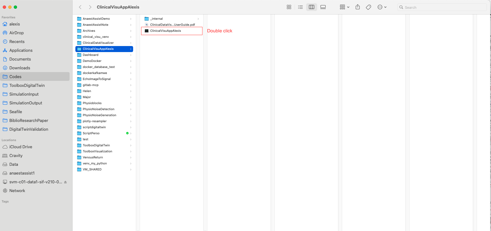
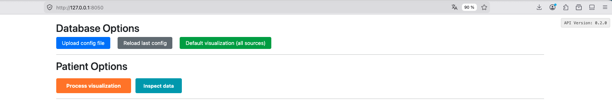
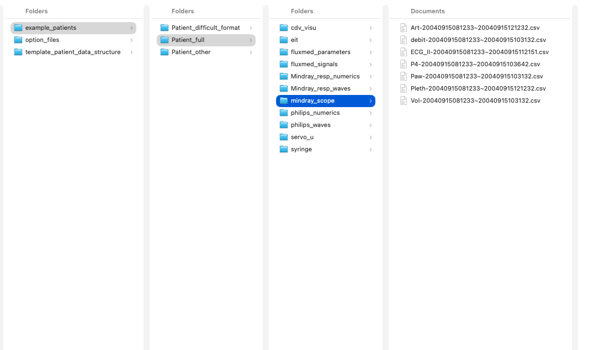
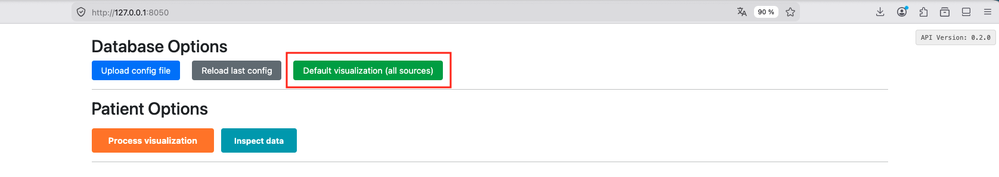
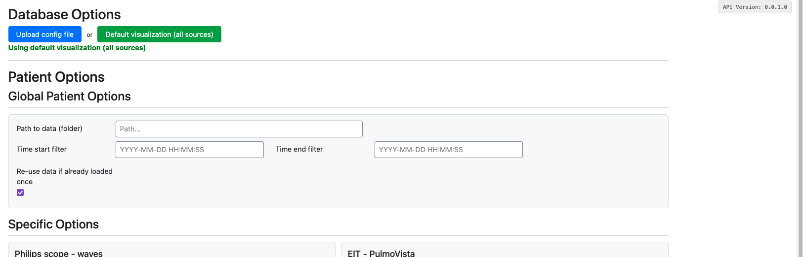
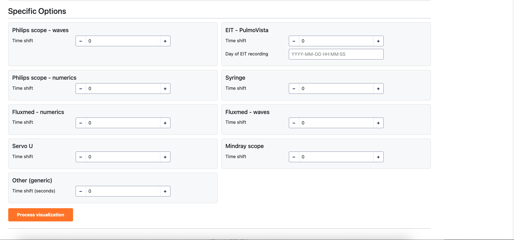
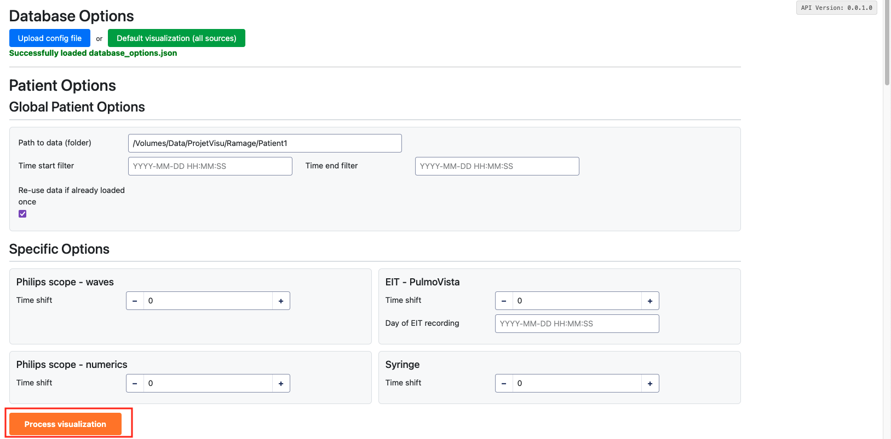
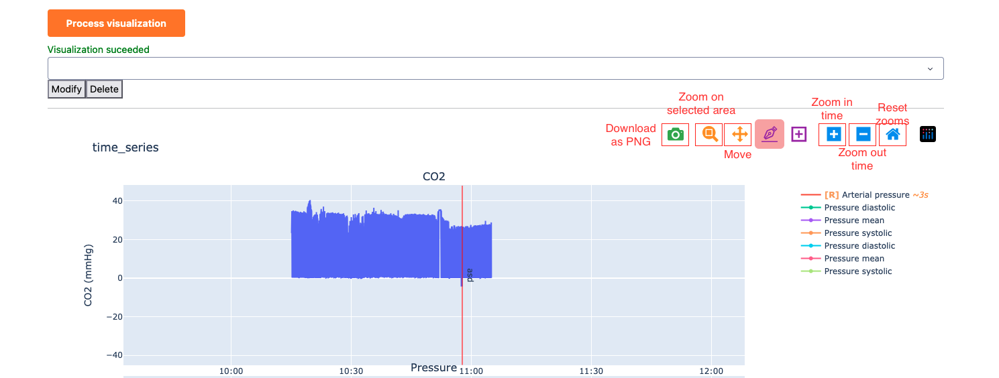
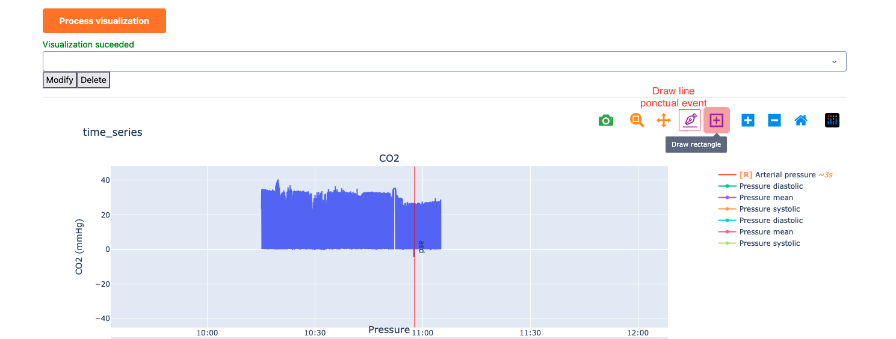

\newpage

# Introduction

Clinical Data Visualizer is an interactive dashboard for visualizing clinical physiological
signals. It allows clinicians and researchers to explore, compare, and annotate time-series data
from multiple medical devices in a single unified interface.

## Key Features

- **Multi-source visualization**: Display signals from up to 9 different clinical data sources
  simultaneously.
- **Interactive plots**: Zoom, pan, and explore data at any time scale with automatic resampling.
- **Annotations**: Draw lines and rectangles directly on plots to mark events or regions of
  interest. Annotations are saved and persist across sessions.
- **Flexible configuration**: Choose which signals to display, customize labels, units, colors,
  and group related signals together.
- **Export**: Generate standalone HTML visualizations for sharing.

## Supported Data Sources

| Data Source | Description |
|---|---|
| Philips Waves | High-frequency waveform data from Philips patient monitors |
| Philips Numerics | Numeric parameter data from Philips monitors (heart rate, SpO2, etc.) |
| EIT (PulmoVista) | Electrical Impedance Tomography data from Draeger PulmoVista |
| FluxMed Signals | Waveform data from FluxMed respiratory monitors |
| FluxMed Parameters | Parameter data from FluxMed monitors |
| Servo-U | Ventilator data from Getinge Servo-U |
| Mindray Scope | Patient monitor waveform data from Mindray scopes (.xml or .csv) |
| Mindray Respi Waves | High-frequency respiratory waveforms from Mindray respiratory monitors |
| Mindray Respi Numerics | Numeric respiratory parameters from Mindray respiratory monitors |
| Syringe | Syringe pump infusion data |
| Other (Generic) | Auto-discovers CSV or Parquet files with datetime columns |

\newpage

# Launching the Application

## Starting the App

Locate the **ClinicalVisuAppAlexis** executable in the application folder and double-click it.

A terminal window will appear showing the application starting up. After a few seconds, your
default web browser will automatically open at:

```
http://127.0.0.1:8050
```

If the browser does not open automatically, manually navigate to the address above.

{ width=100% }

## Application Overview

The interface is organized top-to-bottom in the following order:

1. **Database Options** -- Load or select a visualization configuration.
2. **Patient Options** -- Configure data folder, time range, and per-source settings.
3. **Process / Inspect Buttons** -- Start the visualization or inspect available data.
4. **Annotations Controls** -- Manage annotations (visible after processing).
5. **Visualization Area** -- Interactive plots.

{ width=100% }

\newpage

# Preparing Your Data

## Patient Folder Structure

Each patient's data must be organized in a root folder with **one subfolder per data source**.
The application automatically identifies data sources based on keywords in subfolder names.

```
Patient1/
  philips_waves/          Philips waveform data (.parquet)
  philips_numerics/       Philips numeric data
  eit/                    EIT PulmoVista data (.asc)
  fluxmed_signals/        FluxMed waveform data
  fluxmed_parameters/     FluxMed parameter data
  servo_u/                Servo-U ventilator data (.sta)
  mindray_scope/          Mindray scope data (.xml or .csv)
  mindray_respi_waves/    Mindray respiratory waveforms (.parquet or .csv)
  mindray_respi_numerics/ Mindray respiratory parameters (.parquet or .csv)
  syringe/                Syringe pump data
  other/                  Generic data (.csv or .parquet)
  tdv_visu/               Auto-created: cached data and outputs
```

You only need subfolders for the data sources you actually have. Empty or missing subfolders
are simply skipped.

## Folder Naming Rules

Folder names are **flexible** -- they just need to contain the required keywords
(case-insensitive, any separator allowed):

| Data Source | Required Keywords | Examples |
|---|---|---|
| Philips Waves | `philips` + `waves` | `philips_waves`, `Philips-Waves`, `waves_philips` |
| Philips Numerics | `philips` + `numerics` | `philips_numerics`, `Philips-Numerics` |
| EIT | `eit` | `eit`, `EIT`, `EIT_Data` |
| FluxMed Signals | `fluxmed` + `signals` | `fluxmed_signals`, `FluxMed-Signals` |
| FluxMed Parameters | `fluxmed` + `parameters` | `fluxmed_parameters`, `FluxMed_Parameters` |
| Servo-U | `servo` | `servo_u`, `Servo-U`, `SERVO` |
| Mindray Scope | `mindray` | `mindray_scope`, `mindray`, `Mindray` |
| Mindray Respi Waves | `mindray` + `resp` + `wave` | `mindray_respi_waves`, `mindray_resp_waves` |
| Mindray Respi Numerics | `mindray` + `resp` + `numeric` | `mindray_respi_numerics`, `mindray_resp_numerics` |
| Syringe | `syringe` | `syringe`, `Syringe`, `syringe_pumps` |
| Other | `other` | `other`, `Other` |

## Expected File Types

- **Philips Waves**: `.parquet` files
- **Philips Numerics**: Files containing "numerics" in the filename
- **EIT**: `.asc` files
- **FluxMed**: Files containing "signals" or "parameters" in the filename
- **Servo-U**: `.sta` files
- **Mindray Scope**: `.xml` or `.csv` files
- **Mindray Respi Waves**: `.parquet` or `.csv` files
- **Mindray Respi Numerics**: `.parquet` or `.csv` files
- **Syringe**: Files containing "syringe" in the filename
- **Other**: `.csv` or `.parquet` files (auto-discovers columns with datetime values)

{ width=100% }

\newpage

# Loading Database Options

Database options define **which data sources to enable** and **how signals should be displayed**
(labels, units, colors, grouping).

## Option 1: Default Visualization (Quick Start)

Click the green **"Default visualization (all sources)"** button. This automatically enables all
11 data sources with their default display settings. No configuration file is needed.

This is the recommended starting point for new users.

{ width=100% }

## Option 2: Reload Last Config (Daily Workflow)

If a custom configuration was previously uploaded, a grey **"Reload last config"** button appears
automatically on startup. Click it to instantly restore the last used configuration without browsing
for files.

The cached configuration is stored locally at `~/.clinical_data_visualizer/last_database_options.json`
and contains only signal metadata (labels, colors, units, field mappings) — no patient data.

## Option 3: Custom Configuration File

Click the blue **"Upload config file"** button to load a custom configuration file.
Two formats are accepted:

- **`database_options.json`** — a JSON file following the structure described in Section 9.
- **`database_options.xlsx`** — an Excel spreadsheet following the column layout described in
  Section 9. The spreadsheet is automatically converted to the equivalent JSON structure on load.

This gives you full control over which sources are enabled and how each signal is displayed.

\newpage

# Configuring Patient Options

After loading database options, the **Patient Options** form appears. It is divided into two
parts: global options and per-source options.

## Global Options

These apply to all data sources:

| Option | Description |
|---|---|
| **Path to data (folder)** | Full path to the patient's root data folder |
| **Time start filter** | Start of the time window to display (format: `YYYY-MM-DD HH:MM:SS`). Leave empty to use all available data. |
| **Time end filter** | End of the time window to display. Leave empty to use all available data. |
| **Re-use data if already loaded once** | When checked, reuses previously cached `.parquet` files from the `tdv_visu/` folder, significantly speeding up subsequent loads. |

{ width=100% }

## Per-Source Options

Below the global options, each enabled data source may have additional settings displayed in
individual cards arranged in a two-column grid. Common per-source options include:

- **Time shift** (seconds): Adjust the time alignment of a source relative to others. Useful
  when devices were not perfectly synchronized.
- **Day**: Specify the recording date for sources that require it (e.g., EIT data).

Only data sources present in the loaded database options will show their configuration cards.

{ width=100% }

\newpage

# Processing the Visualization

Once you have configured the patient options, click the large orange **"Process visualization"**
button to start generating the plots.

## What Happens During Processing

1. **Validation**: The application verifies that all mandatory fields are filled in and that the
   data folder exists.
2. **Data Discovery**: For each enabled data source, the application scans the patient folder for
   matching subfolders and files.
3. **Data Loading**: Raw data files are parsed according to each source's format.
4. **Formatting**: Signals are filtered, resampled, and converted using your database options
   (labels, units, time range).
5. **Caching**: Processed data is saved as `.parquet` files in the `tdv_visu/` subfolder for
   faster reloading next time.
6. **Plot Generation**: Interactive Plotly figures are created and displayed in the visualization
   area.

A success message appears when processing completes. If no data is found for a source, it is
silently skipped.

{ width=100% }

## Inspecting Data Before Visualization

Next to the "Process visualization" button, a teal **"Inspect data"** button allows you to
examine available columns and data ranges **before** running the full visualization.

Clicking it opens an inspection modal that shows, for each data source:

- **Status**: Whether the source was found and loaded successfully.
- **File path**: The detected data file or folder.
- **Date ranges**: Both the raw (unfiltered) and filtered time ranges.
- **Columns**: A table listing each signal with its raw name, whether it is configured in the
  database options, and the number of data points (raw and filtered).

This is useful for verifying that data files are correctly detected, checking which signals are
available, and confirming the time range before committing to a full processing run.

A **"Download CSV"** button in the modal header lets you export the inspection results as a CSV
file for further analysis.

\newpage

# Interacting with Plots

## Navigation Controls

Each plot provides a toolbar (top-right corner) with the following tools:

| Tool | Action |
|---|---|
| **Zoom** | Click and drag to zoom into a rectangular region |
| **Pan** | Click and drag to move the view |
| **Zoom In / Zoom Out** | Incremental zoom buttons |
| **Autoscale** | Reset the view to fit all data |
| **Reset Axes** | Return to the original view |
| **Download as PNG** | Save the current plot view as an image |

## Zooming and Panning

- **Scroll wheel**: Zoom in/out on the x-axis.
- **Click and drag**: Select a region to zoom into.
- **Double-click**: Reset the axes to show all data.

## Dynamic Resampling (FigureResampler)

For high-frequency signals (e.g., waveforms sampled at hundreds of Hz), the application uses
**Plotly-Resampler** to dynamically load detail as you zoom in. When viewing a long time range,
the plot shows a downsampled overview. As you zoom into a shorter time window, the full-resolution
data is loaded automatically.

This keeps the interface responsive even with millions of data points.

{ width=100% }

\newpage

# Annotations

The annotation system lets you mark events, time periods, or regions of interest directly on the
plots. Annotations are saved to an `annotations.json` file in the `tdv_visu/` folder and persist
across sessions.

## Drawing Annotations

Use the Plotly drawing tools in each plot's toolbar:

- **Draw Line**: Click two points to draw a vertical line marking a specific event.
- **Draw Rectangle**: Click and drag to highlight a time region or value range.

Each annotations can be given a name and a color via the edit popup that appears after drawing.

## Annotations Management

After processing, the **Annotation Controls** section becomes visible below the Process button:

- **Annotations Dropdown**: Lists all annotations across all figures, showing the annotations
  label.
- **Modify Button**: Opens the edit popup for the selected annotation (change name, color, or
  whether it spans all subplots).
- **Delete Button**: Removes the selected annotation.

## Annotation Properties

Each annotation has the following properties:

- **Name**: A text label displayed on the annotation.
- **Color**: The line or fill color.
- **Global**: When enabled, the annotation spans all subplots in the figure (using paper y-coordinates).

## Persistence

Annotations are automatically saved to `annotations.json` in the patient's `tdv_visu/` folder
whenever you create, modify, or delete an annotation. They are reloaded when you re-process the same
patient data.

{ width=100% }

\newpage

# Configuration File Reference

## patient_options.json

This file defines patient-specific settings. It is automatically saved to the `tdv_visu/`
subfolder each time you click "Process visualization".

```json
{
    "data_folder": "/path/to/patient/data",
    "datetime_start": "2024-10-08 10:00:00",
    "datetime_end": "2024-10-08 12:00:00",
    "quick_load": false,
    "philips_waves": {
        "time_shift": 20.0
    },
    "eit": {
        "day": "2024-10-08"
    }
}
```

| Key | Type | Default | Description |
|---|---|---|---|
| `data_folder` | string | — | Path to the patient's root data folder (required) |
| `datetime_start` | string or null | null | Start of the time window (`YYYY-MM-DD HH:MM:SS`). Leave empty to use all available data. |
| `datetime_end` | string or null | null | End of the time window. Leave empty to use all available data. |
| `quick_load` | boolean | false | Reuse previously cached `.parquet` files in `tdv_visu/` |
| `<source_name>` | object | — | Per-source options block (e.g., `time_shift`, `day`) |

## database_options.json

This file controls which data sources are active and how each signal is displayed. A snapshot is
automatically saved to `tdv_visu/database_options.json` each time you click
"Process visualization".

### Top-Level Structure

```json
{
    "global": {
        "grouped_fields": { "Pressure": ["ART", "PNIs", "PNIm", "PNId"] }
    },
    "philips_waves": { ... },
    "philips_numerics": { ... },
    "eit": { ... }
}
```

Each data source key is optional — only include the sources you want to enable. The presence of a
source key in this file is what activates that source; removing it disables it entirely.

### Per-Source Block Structure

```json
"philips_waves": {
    "field_display": ["ART", "PAP", "P-aer"],
    "signals": {
        "ART": {
            "label": "Arterial pressure",
            "unit": "mmHg",
            "unit_conversion": 1.0,
            "range": [-10, 200],
            "priority": 1.0,
            "color": "red",
            "visible": true,
            "line_dash": "solid",
            "period_resampling": 0.2
        }
    },
    "grouped_fields": {
        "Respiratory": ["P-aer", "CrbVol"]
    },
    "loop": {
        "pv_loop": ["P-aer", "CrbVol"]
    },
    "numerics": {
        "period_resampling": 0.5,
        "priority": 1.0
    }
}
```

### Per-Source Fields Reference

| Key | Type | Default | Description |
|---|---|---|---|
| `field_display` | list of strings | all signals | Signal names to display. Signals absent from this list are loaded but hidden. Omit to show all. |
| `signals` | object | `{}` | Per-signal display options (see below). |
| `grouped_fields` | object | `{}` | Groups of signals to overlay on the same subplot, within this datasource. |
| `loop` | object | `{}` | PV-loop definitions: `{"loop_name": ["x_signal", "y_signal"]}`. |
| `numerics.period_resampling` | float | source default | Resampling period in seconds applied to all numeric parameters of this datasource. |
| `numerics.priority` | float | source default | Plot ordering priority for numerics (lower value = higher on page). |

### Per-Signal Fields Reference (`signals.<signal_name>`)

| Key | Type | Default | Description |
|---|---|---|---|
| `label` | string | signal name | Display label shown on plot axes and legends. |
| `unit` | string | `""` | Unit string shown on the Y-axis (e.g., `"mmHg"`, `"cmH2O"`). |
| `unit_conversion` | float | `1.0` | Multiplication factor applied to raw values for unit conversion. |
| `range` | `[min, max]` or null | auto | Fixed Y-axis range. Either bound can be `null` for auto-scaling. |
| `priority` | float | source default | Plot ordering priority (lower = higher on page). Signals with the same priority share a subplot. |
| `color` | string | auto | Line color (any CSS color string, e.g., `"red"`, `"#1f77b4"`). |
| `visible` | boolean | `true` | Set to `false` to load the signal but hide it from the plot by default. |
| `line_dash` | string | `"solid"` | Line style: `"solid"`, `"dash"`, `"dot"`, `"dashdot"`. |
| `period_resampling` | float | source default | Resampling period in seconds for this specific signal. |

### Global Fields

```json
"global": {
    "grouped_fields": {
        "Pressure": ["ART", "PNIs", "PNIm", "PNId"]
    }
}
```

| Key | Description |
|---|---|
| `global.grouped_fields` | Groups signals from **different** datasources onto the same subplot. Signal names must be unique across the datasources involved. |

## database_options.xlsx

As an alternative to the JSON format, you can provide the same configuration as an Excel
spreadsheet. The file must contain a sheet named **`signals`** and optionally a sheet named
**`loops`**.

### `signals` sheet

One row per signal. The columns `datasource` and `signal` are mandatory; all others are optional
and fall back to the defaults listed in the per-signal table above.

| Column | Required | Description |
|---|---|---|
| `datasource` | Yes | Data source name (e.g., `philips_waves`, `eit`). |
| `signal` | Yes | Raw signal name as it appears in the data. Use `*` to set datasource-level defaults (`period_resampling`, `priority`) without defining a specific signal. |
| `label` | No | Display label. If empty or identical to `signal`, no label override is applied. |
| `unit` | No | Unit string (e.g., `mmHg`). |
| `unit_conversion` | No | Numeric multiplier for unit conversion. |
| `range_min` | No | Minimum Y-axis value. |
| `range_max` | No | Maximum Y-axis value. |
| `priority` | No | Plot priority (float). |
| `color` | No | CSS color string. |
| `visible` | No | `yes` / `no` (default: `yes`). Accepts `yes`, `1`, `true`, `oui`, `vrai` (case-insensitive). |
| `line_dash` | No | `solid`, `dash`, `dot`, `dashdot`. |
| `period_resampling` | No | Resampling period in seconds. |
| `display` | No | `yes` / `no` — whether to add this signal to `field_display`. Default: `yes`. |
| `groups` | No | Semicolon-separated list of group names this signal belongs to (e.g., `Respiratory;Pressure`). Groups spanning a single datasource become local `grouped_fields`; groups spanning multiple datasources become `global.grouped_fields`. |

### `loops` sheet (optional)

One row per PV-loop definition. If the sheet is absent or malformed it is silently skipped.

| Column | Required | Description |
|---|---|---|
| `datasource` | Yes | Data source that owns both signals. |
| `loop_name` | Yes | Name for the loop plot (e.g., `pv_loop`). |
| `x_signal` | Yes | Signal name for the X axis. |
| `y_signal` | Yes | Signal name for the Y axis. |

See `example/option_files/` in the source repository for complete example files in both formats.

\newpage

# Troubleshooting

## Browser Does Not Open Automatically

If the browser does not open after launching the application, manually navigate to:

```
http://127.0.0.1:8050
```

Ensure no other application is using port 8050. If needed, close the terminal window which was opened in the app and restart the application.

## No Data Found

If the visualization is empty or a data source shows no signals:

- Verify that the **data folder path** is correct and accessible.
- Check that subfolders follow the **naming conventions** (see Section 3).
- Ensure the subfolder contains files in the **expected format** for that data source.
- Check that the data source is **enabled** in your database options (or use "Default
  visualization" to enable all).

## Slow Loading

Large datasets may take time to load on the first run. To speed up subsequent loads:

- Enable the **"Re-use data if already loaded once"** (quick_load) option. This uses the cached
  `.parquet` files in `tdv_visu/` instead of re-reading raw data files.

## Time Alignment Issues

If signals from different sources appear misaligned in time:

- Use the **Time shift** option in the per-source settings to adjust alignment.
- Verify that the correct **day** or **date** is set for sources that require it (e.g., EIT).

## Application Crashes or Errors

- Check the terminal window for error messages.
- Log files are available in the `logs/` directory (if running from source).
- Ensure the data files are not corrupted or truncated.

\newpage

# Appendix: Supported Data Sources

| Source | Module Name | Keywords | File Types | Typical Signals |
|---|---|---|---|---|
| Philips Waves | `philips_waves` | `philips`, `waves` | `.parquet` | ART, PAP, CO2, respiratory pressure/volume |
| Philips Numerics | `philips_numerics` | `philips`, `numerics` | numerics in name | Heart rate, SpO2, FiO2, blood pressure |
| EIT | `eit` | `eit` | `.asc` | Global/local impedance, impedance percentages |
| FluxMed Signals | `fluxmed_signals` | `fluxmed`, `signals` | signals in name | Respiratory waveforms |
| FluxMed Parameters | `fluxmed_parameters` | `fluxmed`, `parameters` | parameters in name | Respiratory parameters |
| Servo-U | `servo_u` | `servo` | `.sta` | Ventilator waveforms and settings |
| Mindray Scope | `mindray_scope` | `mindray` | `.xml`, `.csv` | Monitor waveforms (ECG, SpO2, pressure) |
| Mindray Respi Waves | `mindray_respi_waves` | `mindray`, `resp`, `wave` | `.parquet`, `.csv` | High-frequency respiratory waveforms |
| Mindray Respi Numerics | `mindray_respi_numerics` | `mindray`, `resp`, `numeric` | `.parquet`, `.csv` | Respiratory parameters (Vt, RR, PEEP, etc.) |
| Syringe | `syringe` | `syringe` | syringe in name | Infusion rates and volumes |
| Other | `other` | `other` | `.csv`, `.parquet` | Any time-series with datetime columns |
