\newpage

# Introduction

Clinical Scope is an interactive dashboard for exploring, comparing, and annotating clinical physiological signals from multiple medical devices in a single interface.

## Key Features

- **Multi-source visualization**: Display signals from FluxMed, Mindray, EIT, Servo-U and EDF recorders simultaneously.
- **Generic "Other" data source**: Drop any CSV or Parquet file with a datetime column into an `other/` folder — monitor exports, syringe pumps, anything tabular. Signals are auto-discovered and configured per file.
- **Interactive plots**: Zoom, pan, and explore data at any time scale with automatic resampling.
- **Data inspection**: Preview available columns, point counts, and time ranges for every source
  before running the full visualization — exportable to CSV.
- **Annotations**: Draw lines and rectangles directly on plots to mark events or regions of
  interest. Annotations are saved and persist across sessions.
- **Flexible configuration**: Choose which signals to display, customize labels, units, colors,
  and group related signals together — in JSON or Excel format.
- **Cross-datasource phase loops**: Define loop entries to build phase plots that
  combine signals from different devices.
- **Spectrograms**: Render a time-vs-frequency-vs-power view of any signal (e.g. EEG) over a
  configurable frequency band, with a fixed colour range for consistent reading across patients.
- **Power spectral densities (PSD)**: Render power against frequency, averaged over the loaded
  time range, with several signals overlaid on one plot for comparison.
- **Per-datasource timezone control**: Override the timezone of any supported source via
  `additional_informations.timezone` (all plots still render in the configured display timezone).
- **Export**: Generate standalone HTML visualizations for sharing.

The full list of supported data sources — with folder keywords, accepted file extensions, and
typical signals — lives in Section 3: **Patient Data & Supported Data Sources**.

\newpage

# Launching the Application

## First launch

ClinicalScope is not code-signed, so every operating system interrupts the **first** launch with a warning about an unknown publisher. This is expected. The steps below get you past it, and they are needed only once — afterwards the application starts normally.

### Windows

Unzip the archive, then **right-click `ClinicalScope.exe` → Run as administrator**. The first launch needs elevation; a plain double-click will not start it.

SmartScreen may also warn that the publisher is unknown — choose **More info → Run anyway**.

This is a one-time step. After that first run, ClinicalScope starts on a normal double-click, including after a reboot.

### macOS (Apple Silicon)

macOS quarantines downloaded applications and will not open an unsigned one through the normal flow. Remove the quarantine flag from the `.zip` **before** unzipping it:

```bash
cd ~/Downloads
xattr -d com.apple.quarantine ClinicalScope-macOS-arm64.zip
unzip ClinicalScope-macOS-arm64.zip -d ClinicalScope
```

Then run the `ClinicalScope` executable inside the `ClinicalScope` folder.

> **Heads-up:** some browsers (Safari in particular) unzip downloads automatically. If yours does, turn that option off or use another browser — the command above must run on the `.zip` file, not on an already-extracted folder. If you have downloaded the archive more than once, check that you are acting on the right `.zip` and the right extraction folder.

There is no Intel Mac build; on those machines, install with `pip install clinical-scope` instead.

### Linux

Unzip the archive and run the executable, making it executable first if it does not start:

```bash
unzip ClinicalScope-linux-x86_64.zip
chmod +x ClinicalScope/ClinicalScope        # only if needed
./ClinicalScope/ClinicalScope
```

## Starting the App

Locate the **ClinicalScope** executable in the application folder and double-click it. The very first time, follow [First launch](#first-launch) instead — on Windows the executable has to be started as administrator once.

A terminal window will appear showing the application starting up. After a few seconds, your
default web browser will automatically open at:

```
http://127.0.0.1:8050
```

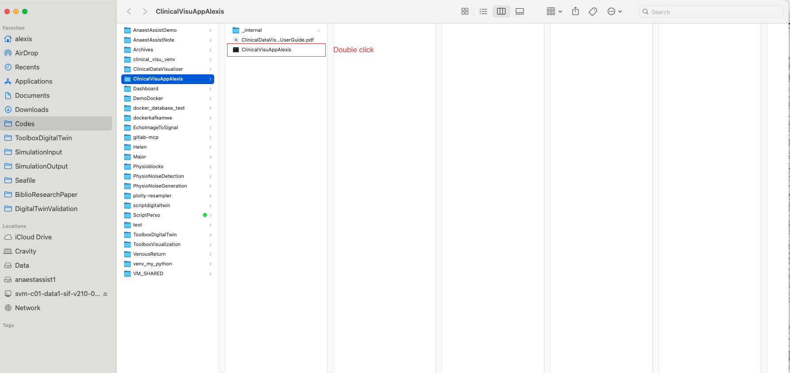{ width=100% }

The bundle also ships this user guide and a template folder for organizing patient data. A `logs` folder appears after the first run, to help with debugging.

To **close** ClinicalScope, close the terminal window that opened with it — the application runs inside that window. If the window is hidden, end the `ClinicalScope` process from your system's process manager.

## Application Overview

The interface is organized top-to-bottom in the following order:

1. **Database Options** -- Three buttons side-by-side:
    - **Upload config file** (blue) -- load a custom `database options` file, either [`.json`](#database_optionsjson) or [`.xlsx`](#database_optionsxlsx).
    - **Reload last config** (grey) -- appears only if a previously uploaded config was cached;
      restores it with one click.
    - **Default visualization (all sources)** (green) -- enables every registered data source with
      default settings, no file needed.
2. **Patient Options** -- Configure data folder, time range, and per-source settings.
   The form is generated dynamically from the loaded database options.
3. **Action buttons** -- **Process visualization** (orange) and **Inspect data** (teal).
4. **Annotations Controls** -- Shape dropdown + Modify/Delete buttons (visible after a
   successful visualization).
5. **Inspection pop-up** -- Full-screen overlay triggered by the Inspect button, with per-source
   status badges, column tables, and a CSV download.
6. **Visualization Area** -- Interactive plots.

A **⚙ Settings** button sits at the top right, above the Database Options row. It opens your personal display and export settings, which apply to every patient you open — see [Settings](#settings).

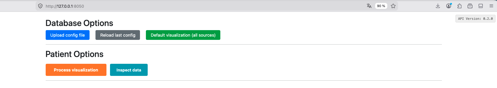{ width=100% }

\newpage

# Patient Data & Supported Data Sources

Each patient's data must be organized in a root folder with **one subfolder per data source**.
The application automatically identifies data sources based on keywords in subfolder names.

You only need subfolders for the data sources you actually have — empty or missing
subfolders are silently skipped. The `clinical_scope_output/` subfolder is created automatically the
first time you process a patient. It contains annotations, `.html` visualizations, formatted data.

## Example Folder Layouts

A full setup with several devices:

```
Patient1/
  eit/
  fluxmed_signals/
  fluxmed_parameters/
  servo_u/
  mindray_scope/
  edf/
  other/
  clinical_scope_output/               ← auto-created
```

An **"Other"-heavy** setup — drop any CSV/Parquet file with a datetime column into
`other/`; each file is configured independently via `other::<stem>` keys in the
database options (see [dedicated section](#generic-other-data-source) below):

```
Patient1/
  other/
    waves.parquet         → configured under "other::waves"
    numerics.csv          → configured under "other::numerics"
    syringe_log.csv       → configured under "other::syringe_log"
  clinical_scope_output/
```

## Folder Naming Rules

Folder names are **flexible** — they just need to contain the required keywords:

- **Case-insensitive** — `Mindray_Scope`, `MINDRAY-SCOPE`, `mindray scope` all match.
- **Any separator** — underscore, dash, space, or none.
- **Any order** — `scope_mindray` works just as well as `mindray_scope`.
- **Partial keywords don't match** — `flux` alone will not match `fluxmed_*`; the full word is required.

A few sources are also **identified by file extension** when the folder is ambiguous or
generic (e.g., `.asc` files inside a folder are enough to classify it as EIT, `.sta` for
Servo-U, `.xml` for Mindray Scope).

## Canonical Data Source Table

| Source | Module name | Folder keywords | Accepted extensions (ordered by preference) | Discovery mode | Typical signals |
|---|---|---|---|---|---|
| EIT (PulmoVista) | `eit` | `eit` | `.asc` | All files | Global/local impedance, impedance percentages |
| FluxMed Signals | `fluxmed_signals` | `fluxmed`, `signals` | `.parquet`, `.txt`, `.csv` | Single file | Respiratory waveforms |
| FluxMed Parameters | `fluxmed_parameters` | `fluxmed`, `parameters` | `.parquet`, `.txt`, `.csv` | Single file | Respiratory parameters |
| Servo-U | `servo_u` | `servo` | `.sta` | All files | Ventilator waveforms and settings |
| Mindray Scope | `mindray_scope` | `mindray` | `.xml`, `.csv` | All files | Monitor waveforms (ECG, SpO2, pressure) |
| Mindray Respi Waves | `mindray_respi_waves` | `mindray`, `resp`, `wave` | `.parquet`, `.csv` | Single file | High-frequency respiratory waveforms |
| Mindray Respi Numerics | `mindray_respi_numerics` | `mindray`, `resp`, `numeric` | `.parquet`, `.csv` | Single file | Respiratory parameters (Vt, RR, PEEP, etc.) |
| EDF / EDF+ | `edf` | `edf` | `.edf` | All files | Any signal an amplifier or recorder exports as EDF (typically EEG) |
| Other (Generic) | `other` | `other` | `.parquet`, `.csv` | All files (one entry **per file**) | Any time-series with a datetime column |

**Single file** sources expect exactly one data file per folder. When several formats coexist
(e.g., `data.csv` and `data.parquet`), the most preferred extension wins. If multiple unrelated
stems remain after that filter, the source is skipped and a warning is logged.

**All files** sources load every matching file in the folder and concatenate them. The `Other`
source is special: each file produces an independent entry named `other::<stem>` (see below).

**EDF recordings.** Channels are read exactly as the file stores them — a file holding bipolar derivations (`Fp1-F7`) shows those, a file holding referential channels shows those. Channels recorded at different sample rates are placed on a shared time axis, each keeping its own sampling.

An EDF header always states a start date and a start time, but de-identification commonly blanks them (the format's "unknown date" is `01.01.1985`), leaving a recording that is effectively relative time only. Place such a recording with the per-source `recording_start` option in [patient_options.json](#patient_optionsjson):

- **A full timestamp** (`2024-10-08 08:12:33`) puts the first sample at that instant — use this when the file's clock time was blanked too.
- **A date alone** (`2024-10-08`) shifts the recording by whole days and keeps the file's own time of day — use this when only the date was scrubbed.
- Times are read in the **device's** timezone (the source's `additional_informations.timezone`, `Europe/Paris` by default), not your display timezone.

A file that still carries a real start date keeps it, and `recording_start` is ignored. A file with no date and no `recording_start` is still plotted, anchored at 1985-01-01, with a warning in the log.

Per-source configuration options (`field_display`, `signals`, `grouped_fields`, `loop`,
`additional_informations`, etc.) are documented in the [Configuration File Reference section](#configuration-file-reference).

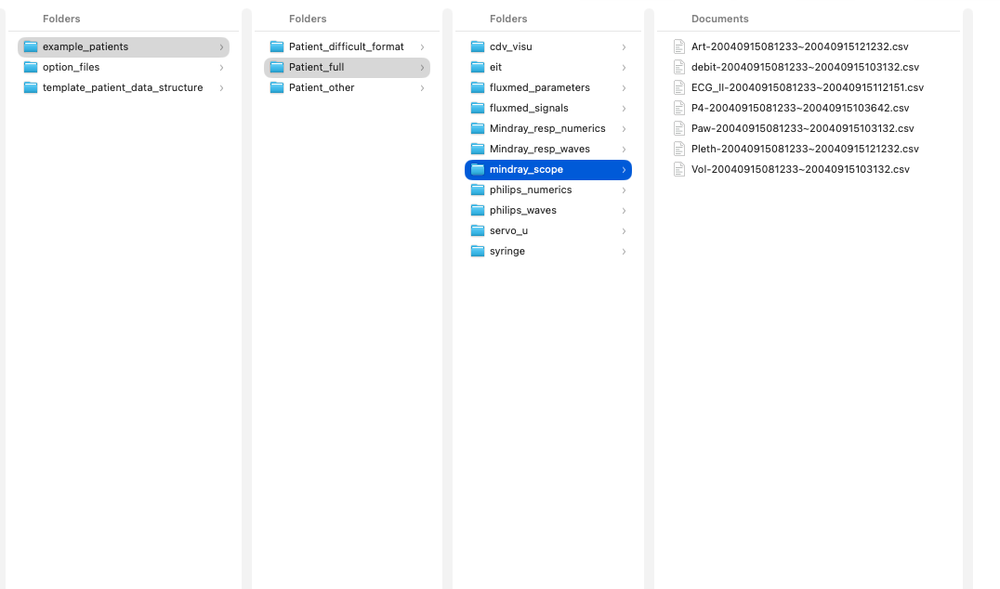{ width=100% }

## Generic "Other" Data Source

`other` is the **generic escape hatch** for any CSV or Parquet file that has a datetime
column but does not fit any of the specialised sources — the most natural entry point if
your data is already well formatted.

**How it works:**

- Drop any number of `.csv` or `.parquet` files into an `other/` subfolder; every one is discovered automatically.
- Each file produces an **independent entry** keyed by its stem (filename without extension): `waves.parquet` becomes `other::waves`.
- Columns within a file are exposed as `<stem>::<column_name>` so names stay globally
  unique (important for cross-datasource groups and loops).

**Datetime column auto-detection.** The loader automatically finds your file's datetime column by name and content, including common non-English names — no configuration needed. If no column can be confidently identified as a timestamp, the file is skipped (with a warning) rather than guessed at.

**Per-file configuration.** In `database_options`, use `other::<stem>` keys — one block per
file — exactly like any other datasource:

```json
"other::waves": {
    "field_display": ["art", "pleth"],
    "signals": {
        "art":   { "label": "Arterial Pressure", "unit": "mmHg", "color": "red" },
        "pleth": { "label": "Plethysmography",  "unit": "AU",   "color": "purple" }
    },
    "additional_informations": { "timezone": "Europe/Paris" }
},
"other::numerics": {
    "field_display": ["FC", "SpO2"]
}
```

**Per-file plots.** A per-file block may also define `grouped_fields`, `loop`, `spectrogram` and `psd`, naming its own columns directly — no `other::<stem>::` prefix needed inside the block:

```json
"other::eeg": {
    "spectrogram": {
        "Fp1": { "signal": "Fp1", "freq_range": [0.5, 30.0] }
    }
}
```

The plot is titled with its file's name in front — the example above appears as `eeg::Fp1` — so two files can each define a `PV` loop or an `Fp1` spectrogram without one replacing the other.

**Per-file timezone.** Each `other::<stem>` block may declare its own `additional_informations.timezone`, for a file exported by a device in another zone. Without it, timestamps that carry no timezone of their own are read as UTC.

**Per-file trace style.** A `trace_options` block changes how that file's traces are drawn — sparse, step-like data (infusion rates, hand-entered values) reads much better with visible points than as a bare line:

```json
"other::syringe": {
    "trace_options": { "mode": "lines+markers", "line_width": 2.0 },
    "additional_informations": { "timezone": "Europe/Paris" }
}
```

The same block works in any per-source section; each `other::<stem>` file carries its own, so a curated infusion log and a raw waveform export can look different. Full key list in [`trace_options` Block](#trace_options-block).

**Per-file processing options.** Every file you declare with an `other::<stem>` key also gets its own box in the *Specific Options* panel, sitting alongside the device boxes rather than nested under a shared "Other" one. Each box carries that file's own `time_shift` and *Group signals by source file*, so a curated two-column export and a ninety-column raw dump can be corrected and laid out independently. Files present in the folder but not declared in `database_options` fall back to the shared "Other (generic)" box. See [patient_options.json](#patient_optionsjson).

**Inspection shows one entry per file**, so you can verify that every file was correctly discovered and parsed — see [Inspect Data](#inspect-data-teal-button).

See `example/demo_database/database_options.json` in the source repository for a full reference
configuration — its `other::waves`, `other::numerics` and `other::syringe` sections configure the
three files shipped in `demo_patient/other/`.

\newpage

# Loading Database Options

Database options define **which data sources to enable** and **how signals should be displayed**
(labels, units, colors, grouping). There are three ways to get one into the app.

## Option 1: Upload a Custom Configuration File

Click the blue **"Upload config file"** button to load a custom configuration. Two formats are
accepted:

- **`.json` extension** — a JSON file following the structure described in
  [Configuration File Reference section](#configuration-file-reference).
- **`.xlsx` extension** — an Excel spreadsheet following the column layout documented in
  the same reference. The spreadsheet is converted to the equivalent JSON structure on load.

When the upload succeeds the file is **cached locally** at
`~/.clinical_scope/last_database_options.json` — this is what powers Option 2 below. A database options file holds only signal metadata (labels, colors, units, field mappings), never patient data or PHI, so nothing sensitive leaves the patient folder.

## Option 2: Reload Last Config (Daily Workflow)

If a custom configuration was previously uploaded, a grey **"Reload last config"** button appears
automatically on startup. Click it to instantly restore the last used configuration without
browsing for files — ideal when you re-open the app every day with the same setup.

## Option 3: Default Visualization (Quick Start)

Click the green **"Default visualization (all sources)"** button. This automatically enables
**every registered data source** with its built-in default display settings — no configuration
file needed. This is the recommended starting point for new users, and it automatically picks up
any new data sources added to the library without requiring a config update. Note that if you have hundreds of timeseries, they will all be plot and you may experience performance issues on the app.

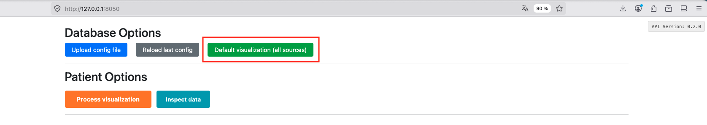{ width=100% }

\newpage

# Configuring Patient Options

After loading database options, the **Patient Options** form appears, generated dynamically from them.

## Global Options

These apply to all data sources:

| Option | Description |
|---|---|
| **Path to data (folder)** | Full path to the patient's root data folder |
| **Time start filter** | Start of the time window to display (format: `YYYY-MM-DD HH:MM:SS`). Leave empty to use all available data. |
| **Time end filter** | End of the time window to display. Leave empty to use all available data. |
| **Re-use data if already loaded once** | When checked, reuses previously cached `.parquet` files from the `clinical_scope_output/` folder, significantly speeding up subsequent loads. **Un-tick** if raw patient data has been modified, or once after updating ClinicalScope |

The time filters are typed and shown in the **Display timezone**, set once in [Settings](#settings) — a label next to the fields names it.

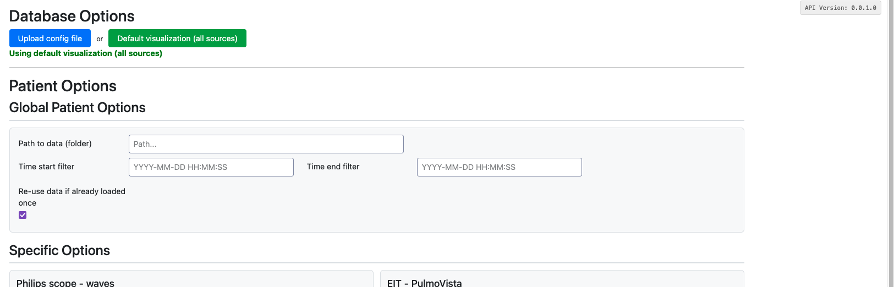{ width=100% }

## Per-Source Options

Each data source present in the loaded database options gets its own card below the global options. Common per-source options:

- **Time shift** (seconds): Adjust the time alignment of a source relative to others. Useful
  when devices were not perfectly synchronized.
- **Day**: Specify the recording date for sources that require it (e.g., EIT data).

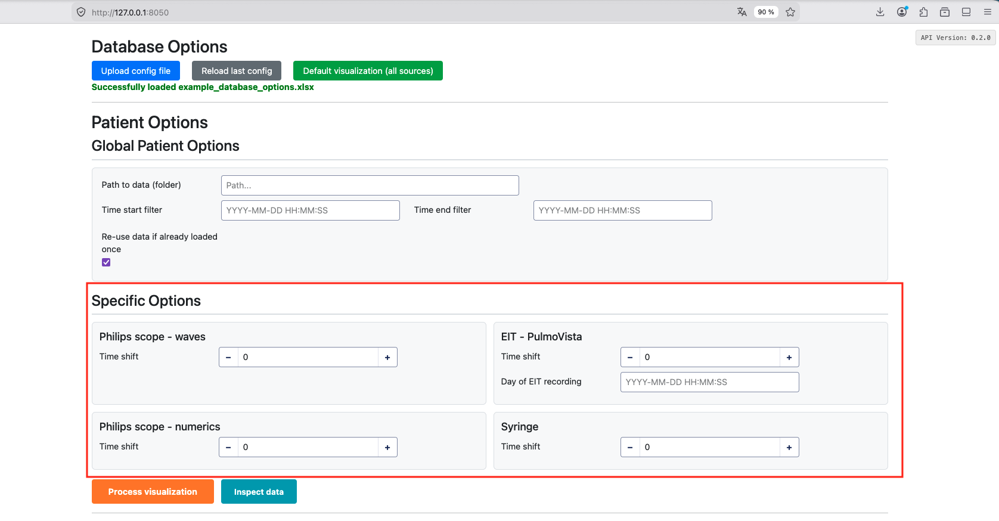{ width=100% }

\newpage

# Settings

The **⚙ Settings** button at the top right opens your personal settings. They belong to you rather than to a patient or a database: they stay the same whichever data you open, and are saved as soon as you change them, so they survive a restart.

**Your settings never overwrite a database options file.** They fill the gaps: if the configuration sets a color for a signal, that color is used; if it says nothing, your palette applies. Changes take effect on the next **Process visualization**.

## App behavior

| Setting | What it does |
|---|---|
| Save a full-resolution HTML export on each Process | Writes `visualization.html` into `clinical_scope_output/` every time you process. Off by default, because the export takes extra time on large recordings. |
| Embed Plotly in the HTML export | Makes the exported file self-contained, so it opens on a machine with no internet access. The file grows by roughly 3.5 MB. Leave it off if the file is only ever opened online. |
| Inspect: read only configured signals | Makes **Inspect data** read only the signals your database options list, instead of everything in the file — lighter on memory, at the price of no longer seeing the signals you have not configured yet. Off by default (see [Inspecting only the signals you configured](#inspecting-only-the-signals-you-configured)). |

## Plot defaults

| Setting | What it does |
|---|---|
| Display timezone | The timezone every plot and the Patient Options time filters are shown in (IANA name, e.g. `Europe/Paris`). Changing it does not move your data — the time filters are rewritten to keep pointing at the same instant, just written in the new timezone's local time. |
| Height of each time-series subplot | In pixels. |
| Height of each loop subplot | Same, for loop plots — which stay square, so this also sets their width. |
| Loop subplots per row | How many loops sit side by side, 1 to 3. |
| Maximum width of one legend entry | Caps how much horizontal room the legend can take from the plot. Longer signal names are truncated. |
| Palette for signals with no color in the config | Both colorblind-safe palettes are readable under the common color-vision deficiencies. |
| Plot theme | Light or dark background. |
| Hover: x-axis time format | Whether the hover panel shows the time only, or the full date and time. |
| Hover: panel style | *Unified* lists every trace at the hovered time in one panel; *closest point only* shows just the nearest trace. Unified is comfortable for a few signals and crowded on a subplot with many. |
| Hover: significant digits of the y value | How precisely hovered values are printed. A signal with its own hover format in the database options keeps it. |
| Spectrogram colour range — minimum / maximum (dB) | Colour scale bounds used by any spectrogram whose configuration leaves `db_range` unset. |

\newpage

# Processing Data

Once patient options are configured, two actions are available from the action row. **Both
run the same data pipeline** — find → load → format — and share the same per-datasource
progress bar. What differs is only the outcome: the orange button builds interactive plots,
the teal button produces a structured summary of what was found.

## Process Visualization (orange button)

Click the large orange **"Process visualization"** button to generate the plots. The steps are:

1. **Validation**: The application verifies that all mandatory fields are filled in and that the
   data folder exists.
2. **Data Discovery**: For each enabled data source, the application scans the patient folder for
   matching subfolders and files.
3. **Data Loading**: Raw data files are parsed according to each source's format.
4. **Formatting**: Signals are filtered, resampled, and converted using your database options
   (labels, units, time range).
5. **Caching**: Processed data is saved as `.parquet` files in the `clinical_scope_output/` subfolder for
   faster reloading next time. Tick **"Re-use data if already loaded once"** (`quick_load`) to
   skip raw parsing on subsequent runs and read the cache instead.
6. **Plot Generation**: Interactive Plotly figures are created and displayed in the visualization
   area.

While processing runs, a **per-datasource progress bar** appears below the action row. It shows
`(completed / total): <datasource>` and its color matches the action — orange for visualization.
The bar advances as each datasource completes; it never reaches 100% while the last source is
still being processed (by design, so you always see which source is active).

A success message appears when processing completes. If no data is found for a source, it is
silently skipped.

## Inspect Data (teal button)

The teal **"Inspect data"** button stops before signal extraction and plot building. It is the **recommended first step** when opening a new patient folder: no figures are built, so it is faster, and it immediately exposes loading errors, missing folders, or unexpected column names — before you run the heavier visualization. The same progress bar is shown, colored teal.

When inspection completes, a **full-screen inspection modal** opens, with one section per
datasource containing:

- **Status badge** — colored per outcome:
    - green `ok` — data loaded successfully
    - orange `file_not_found` — no matching file/folder in the patient directory
    - red `load_error` or `format_error` — loading or formatting raised an exception (the
      error message is shown below the badge)
- **File path** — the detected data file or folder.
- **Date ranges** — two lines. *Date range in file* is the source's own timestamps, untouched.
  *After time options* is what the application will actually plot, once **every** time setting has
  been applied: the source's time shift, its recording start or day for sources that need one, its
  timezone, and finally the `datetime_start` / `datetime_end` window. The second line differing from
  the first is therefore normal and not necessarily a sign that data was cut.
- **Columns table** — each column with: raw name, whether it is configured in the database
  options, the point count in the file, the count kept after the same time options, and the first
  and last kept timestamps.

> **Note for the Other (Generic) source**: because the `other` folder may contain several
> independent files, the inspection modal shows **one entry per file** (e.g. `other::waves`,
> `other::numerics`) rather than a single aggregated entry. Each entry has its own date range
> and column list.

A **"Download CSV"** button in the modal header exports the full inspection result as a CSV
for offline analysis, sharing, or import into the `generate-database-options` helper.

## Inspecting only the signals you configured

Once your database options are settled, the unconfigured columns are usually noise, and reading them costs memory you may not have on a long recording. The setting **"Inspect: read only configured signals"** ([Settings](#settings) → App behavior) makes Inspect read only the signals listed in your database options. A section built that way says so above its table, so a column you do not see is one you have not configured — never one missing from the data.

A small **"Configured columns only: on/off"** label sits next to the Inspect data button itself, mirroring the setting so it stays visible even with the Settings modal closed — a safeguard against running a search for a signal you expect to see, on a setting you forgot was on.

Two things stay true whatever you set here:

- **The time window is never applied while reading.** Inspect's whole point is to compare the file against the window you asked for — how many points survive it, and whether the file even covers it. Reading the window directly would make every source look like a perfect 100% match, and the single most common problem Inspect catches (a window off by an hour, about to plot forty points) would become invisible.
- **The saving only ever applies to a parquet read.** For most sources that means a patient you have already processed once: the first run has to read the manufacturer's export as it comes, and only the copy the application then saves in `clinical_scope_output/` can be read selectively. On a first-ever inspection of those sources the setting changes nothing, and the table shows every column as usual. The **Other (Generic)** source is the exception — it reads its own CSV/parquet files directly rather than through that cache, so a `.parquet` file there is pruned starting on the very first inspection (a `.csv` file there still shows every column, whatever this setting is).

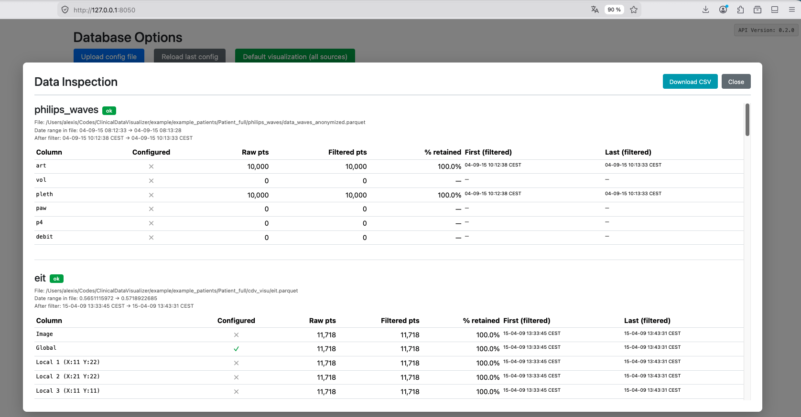{ width=100% }

## Inspecting from the Command Line

The same inspection is available as a standalone script:

```bash
python scripts/inspect_patient_data.py <patient_folder> \
    [--database-options <path>] \
    [--patient-options <path>] \
    [--output-csv out.csv] \
    [--configured-columns-only] \
    [--verbose]
```

Without `--database-options`, all registered datasources are inspected with their defaults.
Pass `--output-csv` to save the same per-column table the UI download produces.
`--configured-columns-only` is the command-line form of the Settings option above, with the same two caveats.

\newpage

# Interacting with Plots

## Navigation Controls

Each plot provides a toolbar (top-right corner) with the following tools:

| Tool | Action |
|---|---|
| **Zoom** | Click and drag to zoom into a rectangular region |
| **Pan** | Click and drag to move the view |
| **Zoom In / Zoom Out** | Incremental zoom buttons |
| **Autoscale** | Reset the view to fit all data |
| **Reset Axes** | Return to the original view |
| **Download as PNG** | Save the current plot view as an image |

Two shortcuts need no toolbar: the **scroll wheel** zooms the x-axis, and a **double-click** resets the axes to show all data.

## Dynamic Resampling (FigureResampler)

For high-frequency signals (e.g., waveforms sampled at hundreds of Hz), the application uses
**Plotly-Resampler** to dynamically load detail as you zoom in. A long time range shows a downsampled overview; zooming into a shorter window loads the full-resolution data automatically. This keeps the interface responsive with millions of data points.

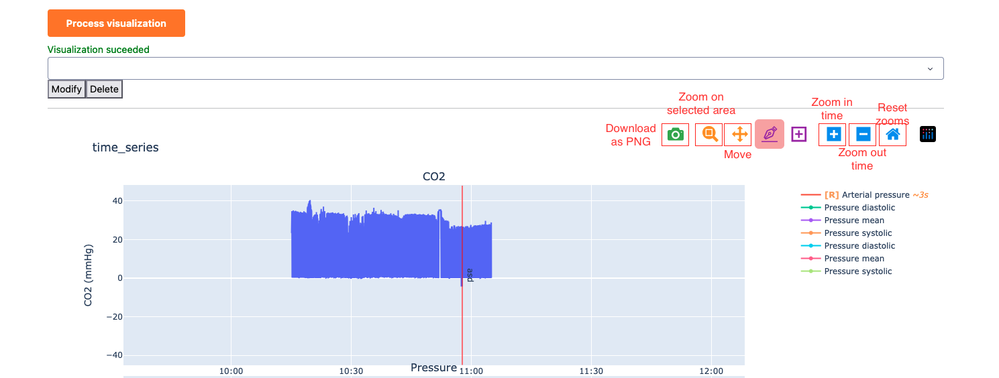{ width=100% }

\newpage

# Annotations

The annotation system lets you mark events, time windows, or individual points directly on the
plots. Annotations are saved to `annotations.json` in the patient folder and persist across
sessions.

## Annotation Toolbar

After a successful visualization, the **annotation toolbar** appears above the plots. It contains:

- **Type buttons** — select the annotation type to place next: *Time Event*, *Time Window*, or *Point*.
- **New Group** — create a named group to organise related annotations.
- **Active group display** — shows which group new annotations will belong to.
- **Save** — writes all annotations to disk.
- **Exit mode** — visible while a type is active; click to stop placing annotations without saving.

## Annotation Types

| Type | Description | Supported plots |
|---|---|---|
| **Time Event** | Vertical line marking a single instant | Time-axis plots only |
| **Time Window** | Shaded region spanning a time range | Time-axis plots only |
| **Point** | Dot marker at a specific (x, y) location | All plots including loop plots |

Click a type button to activate it, then click (or click-and-drag for Time Window) on a plot.
A creation modal appears where you can set a **label** and **color** before confirming.

Spectrograms have a time axis like a time-series plot, so all three types can be placed on them.
Loop and PSD plots take Point annotations only, because their x-axis is a signal value and a frequency respectively, not a time.

## Groups

Annotations can be organised into named groups. Click **New Group**, enter a name, and all
subsequent annotations will belong to that group until you switch or create another. A group is not saved as an entity of its own — each annotation carries its group's name, so an empty group does not survive a save.

## Persistence

`annotations.json` sits in the patient data folder, next to the datasource sub-folders. Annotations are reloaded automatically when you re-process the same patient.

If you write the file by hand or generate it from another tool, any extra fields you add to an annotation are kept as they are.

## Python API

Annotations can be loaded programmatically for analysis:

```python
from clinical_scope import load_annotations, load_database_annotations

# Single patient — accepts a JSON file, a clinical_scope_output/ folder, or a patient folder
annotations = load_annotations("/data/Patient01")

# Whole database — scans all patient sub-folders and sets ann.patient on each result
all_anns = load_database_annotations("/data")
```

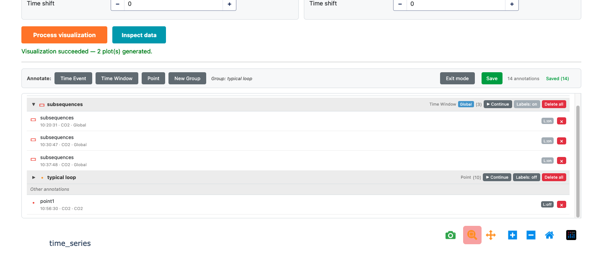{ width=100% }

\newpage

# Configuration File Reference

## patient_options.json

This file defines patient-specific settings. It is automatically saved to the `clinical_scope_output/`
subfolder each time you click "Process visualization".

```json
{
    "data_folder": "/path/to/patient/data",
    "datetime_start": "2024-10-08 10:00:00",
    "datetime_end": "2024-10-08 12:00:00",
    "quick_load": false,
    "other::numerics": {
        "time_shift": 20.0
    },
    "eit": {
        "day": "2024-10-08"
    },
    "edf": {
        "recording_start": "2024-10-08 08:12:33"
    },
    "other::waves": {
        "time_shift": 5.0,
        "group_by_file": false
    }
}
```

| Key | Type | Default | Description |
|---|---|---|---|
| `data_folder` | string | — | Path to the patient's root data folder (required) |
| `output_root` | string | `""` | Writable folder for output when the data folder is read-only. Leave empty to write inside the patient folder. When set, all output goes to `<output_root>/<patient_folder_name>/clinical_scope_output/`. |
| `datetime_start` | string or null | null | Start of the time window (`YYYY-MM-DD HH:MM:SS`). Leave empty to use all available data. |
| `datetime_end` | string or null | null | End of the time window. Leave empty to use all available data. |
| `quick_load` | boolean | false | Reuse previously cached `.parquet` files in `clinical_scope_output/` |
| `<source_name>` | object | — | Per-source options block (e.g., `time_shift`, `day`) |
| `other::<stem>` | object | — | Options for a single file inside `other/`, taking precedence over the shared `other` block. See [Generic "Other" Data Source](#generic-other-data-source). |

> **`output_root` (read-only data folders).** Set this when the patient folder lives on a read-only mount and ClinicalScope cannot write its cache, annotations, or saved configs in place. The layout you already know is reproduced one level deeper, so the root ends up holding one subfolder per patient and `load_database_annotations("<output_root>")` and batch `save_folder` reads work unchanged. Use **one `output_root` per set of patients** — two patient folders sharing a name (e.g. `patient_01`) under the same root would collide.

## database_options.json {#database_optionsjson}

This file controls which data sources are active and how each signal is displayed. A snapshot is
automatically saved to `clinical_scope_output/database_options.json` each time you click
"Process visualization".

### Top-Level Structure

```json
{
    "global": {
        "grouped_fields": { "Pressure": ["other::waves::ART", "servo_u::Airway Press. (cmH2O)"] }
    },
    "other::waves": { ... },
    "servo_u": { ... },
    "eit": { ... }
}
```

Each data source key is optional — only include the sources you want to enable. The presence of a
source key in this file is what activates that source; removing it disables it entirely.

### Per-Source Block Structure

```json
"other::waves": {
    "field_display": ["ART", "PAP", "P-aer"],
    "signals": {
        "ART": {
            "label": "Arterial pressure",
            "unit": "mmHg",
            "unit_conversion": 1.0,
            "range": [-10, 200],
            "priority": 1.0,
            "color": "red",
            "visible": true,
            "line_dash": "solid",
            "period_resampling": 0.2,
            "hover_template": null
        }
    },
    "grouped_fields": {
        "Respiratory": ["P-aer", "CrbVol"]
    },
    "loop": {
        "pv_loop": ["P-aer", "CrbVol"]
    },
    "spectrogram": {
        "Fp1 spectrogram": {
            "signal": "Fp1",
            "freq_range": [0.5, 30.0],
            "db_range": [0, 40]
        }
    },
    "numerics": {
        "period_resampling": 0.5,
        "priority": 1.0
    },
    "trace_options": {
        "mode": "lines+markers",
        "line_width": 2.0
    },
    "additional_informations": {
        "timezone": "Europe/Paris"
    }
}
```

### Per-Source Fields Reference

| Key | Type | Default | Description |
|---|---|---|---|
| `field_display` | list of strings | all signals | Signal names to display. Signals absent from this list are loaded but hidden. Omit to show all. |
| `signals` | object | `{}` | Per-signal display options (see [Per-Signal Fields Reference](#per-signal-fields-reference-signalssignal_name) below). |
| `grouped_fields` | object | `{}` | Groups of signals to overlay on the same subplot, within this datasource. `{"Respiratory waves": ["signal_1", "signal_2", ...], ...}`|
| `loop` | object | `{}` | PV-loop definitions: `{"loop_name": ["x_signal", "y_signal"], ...}`. |
| `spectrogram` | object | `{}` | Spectrogram definitions (see [`spectrogram`](#spectrogram-block) below). |
| `psd` | object | `{}` | Power spectral density definitions (see [`psd`](#psd-block) below). |
| `numerics` | object | `{}` | Datasource-level defaults applied to every signal (see [`numerics`](#numerics-block-datasource-level-defaults) below). |
| `trace_options` | object | source default | How every trace of this datasource is drawn — line, markers, opacity (see [`trace_options`](#trace_options-block) below). |
| `additional_informations` | object | `{}` | Device-level metadata, including timezone override (see [`additional_informations`](#additional_informations-block) below). |

### Per-Signal Fields Reference (`signals.<signal_name>`) {#per-signal-fields-reference-signalssignal_name}

| Key | Type | Default | Description |
|---|---|---|---|
| `label` | string | signal name | Display label shown on plot axes and legends. |
| `unit` | string | `""` | Unit string shown on the Y-axis (e.g., `"mmHg"`, `"cmH2O"`). |
| `unit_conversion` | float | `1.0` | Multiplication factor applied to raw values for unit conversion. |
| `range` | `[min, max]` or null | auto | Fixed Y-axis range. Either bound can be `null` for auto-scaling. |
| `priority` | float | source default | Plot ordering priority (lower = higher on page). Signals with the same priority share a subplot. |
| `color` | string | auto | Line color (any CSS color string, e.g., `"red"`, `"#1f77b4"`). |
| `visible` | boolean | `true` | Set to `false` to load the signal but hide it from the plot by default. |
| `line_dash` | string | `"solid"` | Line style: `"solid"`, `"dash"`, `"dot"`, `"dashdot"`. |
| `period_resampling` | float | source default | Resampling period in seconds for this specific signal. |
| `hover_template` | string | `null` | Custom hover tooltip. Magic keywords: `"fraction"` shows values in (0, 1) as `1/n`; `"percentage"` shows them as `33.3%`. Any other string is passed directly to Plotly as a `hovertemplate`. Leave empty for the default compact display. |

### `numerics` Block (Datasource-Level Defaults)

The `numerics` block sets **default values** for every signal of a datasource without listing each one — despite the name, it does not select only the numeric ones. Any per-signal entry inside `signals` takes precedence.

```json
"other::numerics": {
    "numerics": {
        "period_resampling": 0.5,
        "priority": 2.0
    }
}
```

| Key | Type | Default | Description |
|---|---|---|---|
| `period_resampling` | float | source default | Resampling period in seconds, applied to every signal in this datasource. |
| `priority` | float | source default | Default plot priority for numerics (lower = higher on page). Overridden per signal by `signals.<name>.priority`. |

> In the Excel format, these values are set via the **sentinel row** (`signal = *`).
> See [database_options.xlsx](#database_optionsxlsx).

### `trace_options` Block (Datasource-Level Trace Style) {#trace_options-block}

The `trace_options` block changes how every trace of a datasource is drawn. It works in any per-source block — a device datasource, or an `other::<stem>` file scope — and each key you set replaces the datasource's built-in default while the keys you leave out keep theirs.

A dense overlay reads better semi-transparent — the demo database draws the EIT impedance curves this way, so the individual regions stay legible where they cross:

```json
"eit": {
    "trace_options": { "opacity": 0.7 }
}
```

| Key | Type | Default | Description |
|---|---|---|---|
| `mode` | string | `"lines"` | `"lines"`, `"markers"` or `"lines+markers"`. |
| `line_width` | float | source default | Line width in pixels. |
| `line_dash` | string | `"solid"` | Line style: `"solid"`, `"dash"`, `"dot"`, `"dashdot"`. |
| `opacity` | float | `1.0` | Trace opacity, `0`–`1`. |
| `marker_symbol` | string | source default | Plotly marker symbol (e.g. `"circle"`, `"square"`), used when `mode` includes markers. |
| `marker_size` | float | source default | Marker size in pixels. |

A key you misspell is reported when the configuration is checked, and ignored. Per-signal `color`, `line_dash` and `visible` live in the [`signals`](#per-signal-fields-reference-signalssignal_name) block and win over anything set here — use `trace_options` for the whole datasource and `signals` for the exceptions.

> In the Excel format, these values are set via the **sentinel row** (`signal = *`), in the
> `trace_mode`, `line_width`, `opacity` and `marker_symbol` columns.
> See [database_options.xlsx](#database_optionsxlsx).

### `spectrogram` Block {#spectrogram-block}

The `spectrogram` block defines time-vs-frequency-vs-power plots — one entry produces one subplot, a heatmap with time on the x-axis, frequency on the y-axis, and power as colour. EEG is the main use case, but any sufficiently sampled signal works.

```json
"edf": {
    "spectrogram": {
        "Fp1 spectrogram": {
            "signal": "Fp1",
            "freq_range": [0.5, 30.0],
            "db_range": [0, 40]
        }
    }
}
```

| Key | Type | Default | Description |
|---|---|---|---|
| `signal` | string | — (required) | Raw name of the one signal to analyze. No arithmetic — pair or aggregate signals in the source data first if needed. |
| `freq_range` | `[min_hz, max_hz]` | — (required) | Frequency band to display. There is no workable default — pick the band relevant to the signal (e.g. 0.5–30 Hz for EEG). |
| `db_range` | `[min_db, max_db]` or null | your [Settings](#settings) | Fixed colour scale bounds. Left unset, it falls back to your personal colour range setting — fixed rather than auto-scaled, so appearance stays comparable across patients. |
| `window_s` | float | derived from `freq_range` | Advanced: override the analysis window length in seconds. Leave unset unless you know you need it. |
| `overlap` | float | `0.5` | Advanced: override the fraction of overlap between consecutive analysis windows. Leave unset unless you know you need it. |

A signal whose `period_resampling` decimates it (see [Per-Signal Fields Reference](#per-signal-fields-reference-signalssignal_name)) cannot be turned into a spectrogram — decimation has no anti-aliasing filter, so the result would show rhythms that are not really there. Remove `period_resampling` for that signal to enable its spectrogram; the log explains which signal and why when this happens.

Power is shown as a spectral density in decibels, so the level a signal reads at does not change with `window_s` or with how fast the signal was sampled. One `db_range` therefore stays meaningful across channels recorded at different rates, and two window lengths of the same channel can be compared directly. Window shape, detrending and averaging follow the defaults of the standard Welch method, so the same numbers come out of any reference implementation.

### `psd` Block {#psd-block}

The `psd` block defines power-vs-frequency plots — frequency on the x-axis, power in dB on the y-axis, averaged over the whole loaded time range. Where a spectrogram shows how a rhythm evolves, a PSD shows the shape of the spectrum at rest. One entry produces one subplot, with **one line per signal listed** so several channels can be compared side by side. Typical uses: frequency-domain heart-rate variability, separating ventilation from cardiac components in EIT, and EEG band content.

```json
"edf": {
    "psd": {
        "EEG PSD": {
            "signals": ["chan 1", "chan 2", "chan 3"],
            "freq_range": [0.5, 30.0],
            "db_range": [0, 40]
        }
    }
}
```

| Key | Type | Default | Description |
|---|---|---|---|
| `signals` | list | — (required) | Lines to overlay on this plot — see below for the two ways to write one. |
| `freq_range` | `[min_hz, max_hz]` | — (required) | Frequency band to display. There is no workable default — pick the band relevant to the signal (e.g. 0.5–30 Hz for EEG, 0.04–0.4 Hz for heart-rate variability). |
| `db_range` | `[min_db, max_db]` or null | auto | Fixed bounds for the power axis. Left unset, the axis scales to the data. |

To compute a PSD over part of a recording rather than all of it, narrow the run with the **Time start** / **Time end** filters — a PSD always covers exactly the time range that was loaded.

Each line takes the colour of its signal, so it matches that signal's time-series trace. The `period_resampling` restriction described for spectrograms above applies here too, and refusing one signal refuses the whole plot: a comparison missing one of its channels invites a wrong reading more than an absent plot does. The power axis is the same spectral density described for spectrograms above, which is what lets two lines with different `window_s` values sit on one plot.

**Writing a `signals` entry.** Most of the time a plain name is enough — it is resolved exactly like `grouped_fields` (see [Signal Reference Resolution](#signal-reference-resolution)). Write an object instead when you want to compare the *same* signal analyzed two different ways on the same plot — e.g. a short vs. a long analysis window, to see whether a longer window is smearing two close frequency peaks together:

```json
"psd": {
    "EEG PSD": {
        "signals": [
            {"signal": "chan 1", "window_s": 2.0, "label": "narrow window"},
            {"signal": "chan 1", "window_s": 8.0, "label": "wide window"}
        ],
        "freq_range": [0.5, 30.0]
    }
}
```

| Key | Type | Default | Description |
|---|---|---|---|
| `signal` | string | — (required) | The signal for this line, resolved the same way as a plain-string entry. |
| `window_s` | float | derived from `freq_range` | Advanced: override the analysis window length in seconds for this line only. |
| `overlap` | float | `0.5` | Advanced: override the fraction of overlap between consecutive analysis windows for this line only. |
| `label` | string | the signal's own name | What this line is called on hover. **Required** when the same signal appears more than once in one plot — otherwise the two lines are indistinguishable. |
| `color` | string | the signal's own colour | Line colour for this line only. Two lines from the same signal otherwise inherit the same colour and overlap indistinguishably. |
| `line_dash` | string | the signal's own dash style | `solid`, `dash`, `dot`, `dashdot` for this line only — a second way (besides colour) to tell two lines from the same signal apart. |

### `additional_informations` Block

The `additional_informations` block carries device-level metadata that affects how raw data
is interpreted. Currently its only field is `timezone`.

```json
"eit": {
    "additional_informations": { "timezone": "UTC" }
}
```

| Key | Type | Default | Description |
|---|---|---|---|
| `timezone` | string | source default | Override the timezone used to give a timezone (e.g., `"Europe/Paris"`, `"UTC"`) to timestamps which are timezone-naive. All plots still render in the configured display timezone. |

All datasources apply timezone according to the same rule:

- If the loaded data already carries timezone information, it is kept as-is.
- If the data is timezone-naive, the timezone is resolved in this order:
  1. `additional_informations.timezone` in the database options (if present)
  2. The datasource's built-in default timezone

> In the Excel format, set the timezone via the **sentinel row** (`signal = *`,
> `timezone` column). See [database_options.xlsx](#database_optionsxlsx).

### Global Fields

```json
"global": {
    "grouped_fields": {
        "Pressure": ["ART", "PNIs", "PNIm", "PNId"]
    },
    "loop": {
        "PV loop (ventilator vs. FluxMed)": [
            "servo_u::Paw", "fluxmed_signals::Vt"
        ]
    }
}
```

| Key | Description |
|---|---|
| `global.grouped_fields` | Groups signals from **different** datasources onto the same subplot. Signal names must be unique across the datasources involved — use `datasource::raw_name` to disambiguate. |
| `global.loop` | Cross-datasource phase loops: `{"loop_name": ["x_ref", "y_ref"]}`. Both signals can come from different datasources. Each `*_ref` is resolved by the same three-mode chain as `grouped_fields`. |

### Signal Reference Resolution

Signal references in `grouped_fields`, `loop` and `psd` are resolved by the following
three-mode lookup chain — in `global.grouped_fields` and `global.loop`, and in the
per-source blocks alike:

1. **Qualified reference** `datasource::raw_name` — explicit and unambiguous. Recommended
   when the same column name exists in several datasources.
2. **Display name** — the `label` from the signals block. Works when the label is unique
   across sources; a warning is logged if it matches several signals.
3. **Raw name fallback** — the column name as it appears in the raw data file.

A signal from a file inside `other/` can be written either way: `other::waves::art` is the
fully qualified form, and `waves::art` is the raw-name form — both reach the same signal.

One consequence: if a file inside `other/` is named after a data source — `other/servo_u.parquet`
— then `servo_u::Paw` could mean either that file's `Paw` column or the real servo-u one. The
data source always wins, and the log tells you so and gives you the fully qualified spelling
(`other::servo_u::Paw`) that reaches the file's column instead.

Multi-cycle loops are rendered with a **time-range slider** below the plot so you can scroll
through cycles.

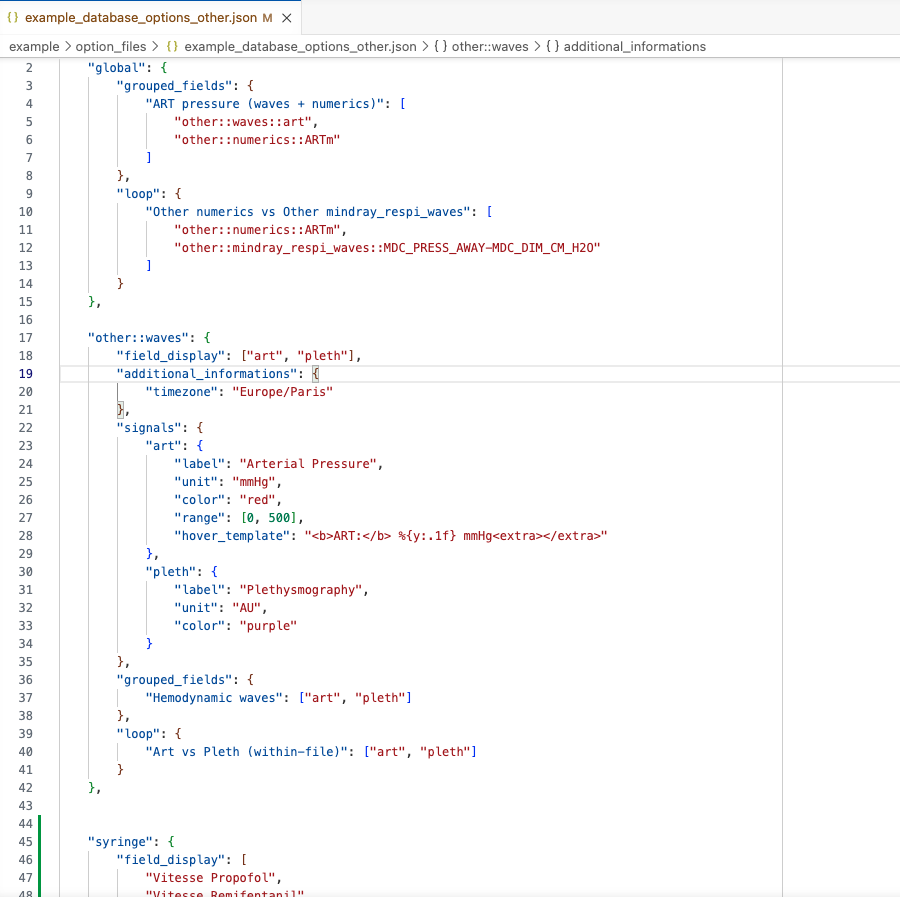{ width=100% }

\newpage

## database_options.xlsx {#database_optionsxlsx}

For clinical users, the **Excel format is the recommended way** to configure signals — it
requires no knowledge of JSON and can be edited in any spreadsheet application. On upload, it
is automatically converted to the equivalent [JSON structure](#database_optionsjson), so every
option available in JSON is also available in the spreadsheet.

The file must contain a sheet named **`signals`**, and may add **`loops`**, **`spectrograms`** and **`psds`**. An optional sheet that is absent or malformed is silently skipped.

### `signals` sheet

One row per signal. The columns `datasource` and `signal` are mandatory; all others are optional
and fall back to the defaults listed in the per-signal table above.

Use `*` in the `signal` column to write a **sentinel row** that sets datasource-level defaults
(e.g., a common `period_resampling` or `timezone`) without defining a specific signal — equivalent
to the [`numerics` and `additional_informations` blocks](#numerics-block-datasource-level-defaults)
in JSON.
Column names are case-insensitive (e.g., `Label`, `UNIT`, `Hover_Template` all work).

The **Scope** column below indicates where each field is meaningful:

- **Both** — valid in sentinel (`*`) and per-signal rows
- **Signal** — per-signal rows only; ignored in sentinel rows
- **Sentinel** — sentinel (`*`) rows only; a warning is logged if set in a per-signal row

| Column | Required | Scope | Description |
|---|---|---|---|
| `datasource` | Yes | Both | Data source name (e.g., `servo_u`, `eit`, `other::waves`). |
| `signal` | Yes | Both | Raw signal name. Use `*` for a sentinel row that sets datasource-level defaults. |
| `label` | No | Signal | Display label. Defaults to the signal name if empty or identical. |
| `unit` | No | Signal | Unit string (e.g., `mmHg`). |
| `unit_conversion` | No | Signal | Numeric multiplier for unit conversion. |
| `range_min` | No | Signal | Minimum Y-axis value. |
| `range_max` | No | Signal | Maximum Y-axis value. |
| `priority` | No | Both | Plot priority (float). In a sentinel row sets the datasource-level default; in a signal row overrides it for that signal only. |
| `color` | No | Signal | CSS color string. |
| `visible` | No | Signal | `yes` / `no` (default: `yes`). Set `no` to draw the signal but start it hidden — it stays in the legend, and one click brings it back. Accepts `yes`, `1`, `true`, `oui`, `vrai` (case-insensitive). |
| `line_dash` | No | Signal | `solid`, `dash`, `dot`, `dashdot`. |
| `period_resampling` | No | Both | Resampling period in seconds. In a sentinel row sets the datasource-level default; in a signal row overrides it for that signal only. |
| `hover_template` | No | Signal | Hover tooltip format. Magic keywords: `"fraction"` shows values in (0, 1) as `1/n`; `"percentage"` shows them as `33.3%`. Any other string is forwarded directly to Plotly as a `hovertemplate`. |
| `display` | No | Signal | `yes` / `no` — whether to add this signal to the display list. Default: `yes`. Set `no` to keep the row's label and unit on file while leaving the signal out of the plots entirely: unlike `visible`, it produces no trace and no legend entry. Useful for parking a signal you may want back later, or for describing a column that is not worth plotting (see `Comments(-)` under `fluxmed_parameters` in `example/demo_database/database_options.xlsx`). |
| `groups` | No | Signal | Semicolon-separated group names (e.g., `Respiratory;Pressure`). Groups within one datasource become local `grouped_fields`; groups spanning multiple datasources become `global.grouped_fields`. |
| `timezone` | No | **Sentinel** | Override the timezone for this datasource (e.g., `"Europe/Paris"`, `"UTC"`). Only valid in `*` rows; a warning is logged if placed in a per-signal row. Works with `other::<stem>` datasource keys. See [`additional_informations` Block](#additional_informations-block) for which datasources support this. |
| `trace_mode` | No | **Sentinel** | `lines`, `markers` or `lines+markers` for every trace in this datasource, `other::<stem>` keys included — e.g. a sparse infusion log reads better as `markers` than as connected `lines`. Only valid in `*` rows; see [`trace_options`](#trace_options-block). |
| `line_width` | No | **Sentinel** | Line width in pixels for every trace in this datasource. Only valid in `*` rows. |
| `opacity` | No | **Sentinel** | Trace opacity, `0`-`1`. Only valid in `*` rows. |
| `marker_symbol` | No | **Sentinel** | Plotly marker symbol (e.g., `circle`, `square`) used when `trace_mode` includes `markers`. Only valid in `*` rows. |

### `loops` sheet (optional)

One row per PV-loop definition — equivalent to the `loop` key in the
[JSON per-source block](#per-source-block-structure) or in `global`.

| Column | Required | Description |
|---|---|---|
| `datasource` | Yes | Data source that owns both signals. |
| `loop_name` | Yes | Name for the loop plot (e.g., `pv_loop`). |
| `x_signal` | Yes | Signal name for the X axis. |
| `y_signal` | Yes | Signal name for the Y axis. |

### `spectrograms` sheet (optional)

One row per spectrogram definition — equivalent to the `spectrogram` key in the
[JSON per-source block](#spectrogram-block).

| Column | Required | Description |
|---|---|---|
| `datasource` | Yes | Data source that owns the signal. |
| `spectrogram_name` | Yes | Name for the spectrogram plot (e.g., `Fp1 spectrogram`). |
| `signal` | Yes | Raw name of the signal to analyze. |
| `freq_min` | Yes | Minimum frequency to display (Hz). |
| `freq_max` | Yes | Maximum frequency to display (Hz). |
| `db_min` | No | Colour scale minimum (dB). Leave both `db_min` and `db_max` empty to use your personal colour range setting. |
| `db_max` | No | Colour scale maximum (dB). Must be set together with `db_min`, or both are ignored. |
| `window_s` | No | Advanced: override the analysis window length in seconds. Leave unset unless you know you need it. |
| `overlap` | No | Advanced: override the fraction of overlap between consecutive analysis windows. Leave unset unless you know you need it. |

### `psds` sheet (optional)

One row per signal — equivalent to the `psd` key in the [JSON per-source block](#psd-block). A
signal can belong to zero, one, or several PSD plots, just like the `groups` column on the
[`signals` sheet](#signals-sheet). Signals sharing a group are overlaid on the same plot, one line
each.

| Column | Required | Description |
|---|---|---|
| `datasource` | Yes | Data source that owns the signal. |
| `groups` | Yes | Semicolon-separated PSD plot names (e.g., `EEG PSD;Low band`). Each name becomes its own plot; signals sharing a name overlay on it. Leave empty to exclude the signal from every PSD plot. |
| `signal` | Yes | Raw name of the signal for this line. |
| `freq_min` | Yes | Minimum frequency to display (Hz). Read from the first row that introduces each plot; a later row with a different value logs a warning and is ignored. |
| `freq_max` | Yes | Maximum frequency to display (Hz). Same first-row-wins rule as `freq_min`. |
| `db_min` | No | Power axis minimum (dB). Leave both `db_min` and `db_max` empty to scale the axis to the data. Same first-row-wins rule as `freq_min`. |
| `db_max` | No | Power axis maximum (dB). Must be set together with `db_min`, or both are ignored. |
| `window_s` | No | Advanced: override the analysis window length in seconds for this row's line only. Leave unset unless you know you need it. |
| `overlap` | No | Advanced: override the fraction of overlap between analysis windows for this row's line only. |
| `label` | No | What this line is called on hover. **Required** when the same signal appears more than once in one plot (e.g. comparing two `window_s` values) — otherwise the two lines are indistinguishable. |
| `color` | No | Line colour for this row's line only. Leave unset to inherit the signal's own colour — two rows for the same signal then need this to tell their lines apart. |
| `line_dash` | No | `solid`, `dash`, `dot`, `dashdot` for this row's line only. A second way (besides colour) to tell two lines from the same signal apart. |

See `example/demo_database/` in the source repository for a complete example in both formats — `database_options.xlsx` (all four sheets) and `database_options.json`, its exact equivalent. Both configure the shipped `demo_patient/`, so you can load either one and press Process straight away.

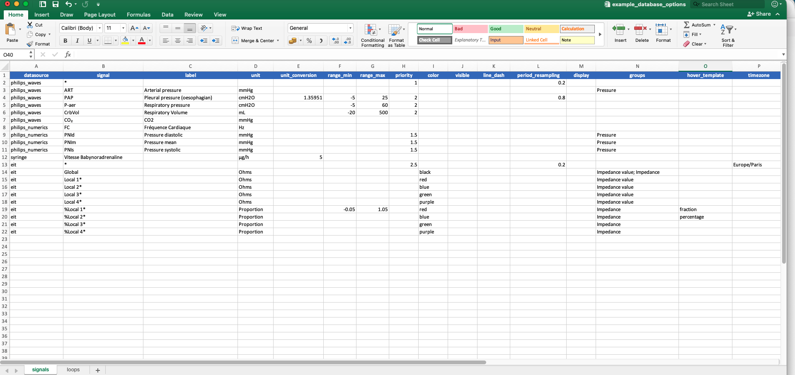{ width=100% }
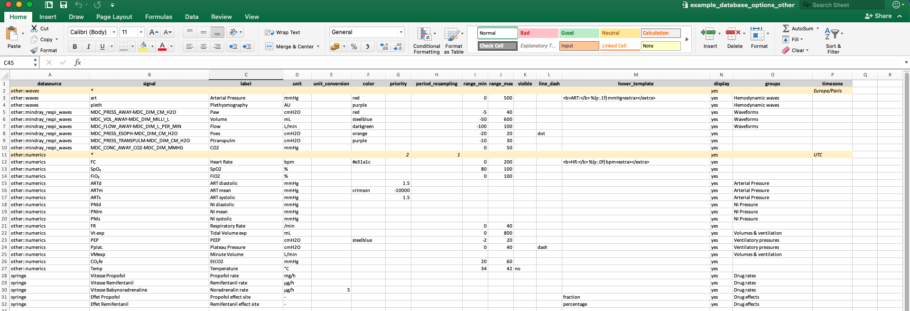{ width=100% }
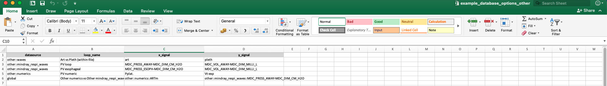{ width=100% }

\newpage

# Troubleshooting

## Browser Does Not Open Automatically

If the browser does not open after launching the application, manually navigate to:

```
http://127.0.0.1:8050
```

Ensure no other application is using port 8050 (typically a previous app launch terminal tab not yet closed). If needed, close the terminal window which was opened in the app and restart the application.

## No Data Found

If the visualization is empty or a data source shows no signals:

- Start by inspecting the data (teal button) rather than visualizing it — it reports much more about what the app could gather from the data.
- Try the default visualization database options, to rule out your own options hiding the data.
- Verify that the **data folder path** is correct and accessible.
- Check that subfolders follow the **naming conventions** (see Section 3).
- Ensure the subfolder contains files with one of the **accepted extensions** for that data
  source (see Section 3). Files with unrecognized extensions are silently ignored.
- For **single-file** sources: if the folder contains multiple unrelated data files (different
  stems), the source is skipped. Keep only one data file per folder, or provide the same data
  in multiple formats (e.g., `data.csv` + `data.parquet`) and the preferred format will be
  selected automatically.

## Slow Loading

Large datasets may take time to load on the first run. To speed up subsequent loads:

- Enable the **"Re-use data if already loaded once"** (quick_load) option. This uses the cached
  `.parquet` files in `clinical_scope_output/` instead of re-reading raw data files.

## Time Alignment Issues

If signals from different sources appear misaligned in time:

- Use the **Time shift** option in the per-source settings to adjust alignment.
- Verify that the correct **day** or **date** is set for sources that require it (e.g., EIT).

## Application Crashes or Errors

- Check the terminal window for error messages.
- Log files are available in the `logs/` directory.
- Ensure the data files are not corrupted or truncated.
- If you think you are facing a real bug, please report it on the [GitHub issues page](https://github.com/larib-data/clinical-scope/issues).

## Known limitations

These may be tackled in the future, depending on what users need — ask for any of them on the [issues page](https://github.com/larib-data/clinical-scope/issues).

- No timeshift inside a datasource, e.g. if 2 timeseries from `servo_u` are not aligned, this currently can't be solved in the app. (Files inside `other/` are the exception — each gets its own `time_shift`.)
- `output_root` keys each patient by its folder name only, so two patient folders with the same name under one `output_root` overwrite each other — see [patient_options.json](#patient_optionsjson).
- EIT recordings spanning more than one calendar day are unsupported: the device's own files carry no date, so the day is inferred from the **day** option (or, if unset, from **Time start filter**) and applied to the whole recording.
- Spectrograms and PSDs expose only `freq_range`, `db_range`, `window_s` and `overlap`. Everything else about the analysis — window shape, detrending, how windows are averaged, how recording gaps and irregular timestamps are handled — is fixed at the standard Welch defaults and cannot be changed from the config.
- A spectrogram or PSD figure does not state the settings it was drawn with, nor whether anything happened to the data on the way (timestamps regularised, gaps skipped). Keep the `database_options` file alongside the figure if you need that record — for instance to describe the analysis in a publication.
